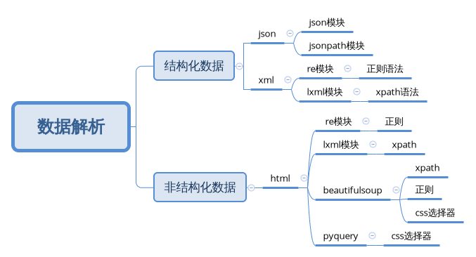

[TOC]
# 爬虫基础

## 爬虫概述

### 1. 爬虫的概念

**模拟浏览器，发送请求，获取响应**

### 2. 爬虫的作用
数据采集</br>
软件测试</br>
抢票</br>
网站上的投票</br>
网络安全</br>

### 3. 爬虫的分类

#### 3.1 根据爬取网站的数量

- 通用爬虫： 如搜索引擎
- 聚焦爬虫：如12306抢票，或者专门爬取某一类(个)网站数据

#### 3.2 是否以获取数据为目的

- 功能性爬虫：投票，点赞
- 数据增量型爬虫：如招聘信息

#### 3.3 根据url地址变化和对应页面内容是否改变，数据增量爬虫可以细分
- 基于url地址变化，内容也变化的数据增量爬虫
- url地址不变，内容变化的数据增量型爬虫

### 4. 爬虫的流程
url</br>
发送请求，获取响应</br>
解析</br>

## http协议复习
### 1. http以及https的概念和区别
> HTTPS比HTTP更安全，但是性能更低

- HTTP: 超文本传输协议 默认端口80
	- 超文本： 超过文本，不仅限于文本，还包括图片、音频、视频等文件。
	- 传书协议：用固定格式来传递转换成字符串的超文本内容.
- HTTPS: HTTP+SSL(安全套接字）就是带有安全套接字协议的超文本传输协议 默认端口443
	- SSL对传输的内容进行加密
- 可以打开浏览器访问一个url，右键检查，点击net work,点选一个url,查看http协议的形式

### 2. 常见的请求头和响应头

请求头</br>
```
host	域名

Connection	长连接

Upgrade-Insecure-Requests	升级为HTTPS连接

* User-Agent	User-Agent: Mozilla/5.0 (X11; Linux x86_64; rv:78.0) Gecko/20100101 Firefox/78.0 
用户代理，提供系统信息和浏览器信息

* Referer		页面跳转处，防盗链(这次访问是从哪里过来的)

* Cookie 		状态保持

Authorization(自己做测试的时候，用于认证的信息)
```
响应头

```
Set-Cookie	(对方服务器设置cookie到用户浏览器的缓存)

```

### 3. 常见的响应状态码

- 200: 成功
- 302: 跳转，新的url在响应的Location头中给出
- 303: 浏览器对于POST的响应进行重定向至新的url
- 307: 浏览器对于GET的响应重定向至新的url
- 403: 资源不可用;服务器理解客户的请求，但拒绝处理它(没有权限)
- 404: 找不到该页面
- 500: 服务器内部错误
- 503: 服务器由于维护或者负载过重未能应答，在响应中可能会携带Retry-After响应头;有可能是因为爬虫频繁访问url,使服务器忽略爬虫的请求,最终返回503响应状态码

### 4.状态码
**所有状态码都不可信，一切以是否从抓包得到的响应中获取到数据为准**

network中抓包得到的源码才是判断依据，elements中的源码是渲染之后的源码，不能作为判断标准

### 5.浏览器请求的过程
```
浏览器
	发送所有请求，进行渲染
爬虫
	只发送指定请求，不会渲染
骨骼文件
	html静态文件
肌肉文件
	js/ajax请求
皮肤
	CSS/Font/图片
抓包过程：
	根据发送请求的流程分别在骨骼/肌肉/皮肤响应中查找数据 
```
**爬虫是不会进行渲染的，所以需要进行抓包查找数据**

### 6.HTTP协议的其他参考阅读

* https://blog.csdn.net/qq_33301113/article/category/6943422/2
* https://www.xuebuyuan.com/3252125.html
* https://baike.baidu.com/item/http/243074?fr=aladdin
* https://www.janshu.com/p/cc1fea7810b2
* https://blog.csdn.net/qq_30553235/article/details/79282113
* https://segmentfault.com/1/1010000002403462


# resquests模块

> requests 是http模块，用于发送请求获取响应，有替代模块urllib模块，但是工作中用的最多的还是requests模块，requests 模块代码简介易懂，用requests编写的爬虫代码会更少，功能实现起来更简单

## requests模块

知识点:
- 掌握 headers参数的使用
- 掌握 发送带参数的请求
- 掌握 headers中携带cookie
- 掌握 cookies参数的使用
- 掌握 cookieJar的转换方法
- 掌握 超时参数timeout的使用
- 掌握 代理ip参数proxies的使用
- 掌握 使用verify参数忽略CA整数
- 掌握 requests模块发送POST请求
- 掌握 利用requests.session进行状态保持

### 1.requests模块介绍

> requests文档

#### 1.1 requestes模块作用：

* 发送http请求，获取响应数据

#### 1.2 requests 是第三方模块，需要在python(虚拟)环境中额外安装

* pip/pip3 install requests

#### 1.3 requests模块发送get请求

> 1.需求：通过requests向百度发送请求，获取页面的源码
> 2.运行下面代码，观察打印输出的结果

```python
# 代码实现
##导入requests模块
import requests

##设置url
url = 'https://www.baidu.com'

## 发送get请求，获取响应
response = requests.get(url)

## 打印响应内容
print(resposne.text)
 
```


### 2.response响应对象

> 上面的代码发现打印出来的好多乱码，这是因为编解码使用了不同的字符集

#### 2.1 response.text 和response.content的区别

- requests.text
	- 类型: str
	- 解码类型： requests模块自动根据http头部对响应的编码作出有根据的推测，推测出的文本编码
- response.content
    	- 类型:bytes
	- 解码类型:没有指定

```python
##导入requests模块
import requests

##设置url
url = 'https://www.baidu.com'

## 发送get请求，获取响应
response = requests.get(url)

## 打印响应内容
#print(resposne.text)
#这种直接打印方式是按照推测出的编码格式打印
# 手动设置response的编码格式,解决编码问题
#response.encoding = 'utf8'
#print(response.text)

```

#### 2.2 通过对response.content进行decode来解决中文乱码

- response.content.decode()	默认utf-8
- response.content.decode('GBK')
- 常见的编码字符集
	- utf-8
	- gbk
	- gb2312
	- ascii
	- iso-8859-1

```python
## 使用response.content
print(response.content.decode('utf8'))
```

#### 2.3 response响应对象的其他常用 属性或方法

> response = requests.get(url)中response是发送请求的响应对象；response响应对象中除了text、content获取响应内容以外还有其他常用的属性或方法：

- response.url 响应的url
- response.status_code 响应状态码
- response.request.headers 响应对应的请求头
- response.header 响应头
- response.request_cookies 响应对象请求的cookie;返回coolkieJar类型
- response.cookies 响应的cookie(经过了set-cookie动作；返回cookieJar类型)
- response.json() 自动将json字符串类型的响应内容转换为python对象(dict or list)

```python
# response的其他属性
import requests

# 目标url
url = 'https://www.baidu.com'

# 向目标url发送get请求，并获取响应存储到response
response = requests.get(url)

print(response.url)	#打印响应的url

print(response.status_code)	#打印响应的状态码

print(response.request.headers)		#打印响应对象的请求头

print(response.headers)		#打印响应头

print(response.request._cookies)     # 打印请求携带的cookies

print(response.cookies)     # 打印响应中携带的cookies

```

### 3.requests模块发送请求

#### 3.1 发送带header的请求

> 先写一个获取百度首页的代码

```python

import requests

url = 'https://www.baidu.com'

response = requests.get(url)

print(response.content.decode())

print(response.request.headers)

```

##### 3.1.1 思考
1. 对比浏览器上百度首页的网页源代码和上面代码中获取的百度首页的源码，有什么不同？

    - 查看网页源码的方式：
        - 右键-查看网页源代码
        - 右键-检查
        - <kbd>F12</kbd>
2. 对比对应url的响应内容和代码获取的百度首页的源码，有什么不同？

    -   查看对应url响应内容的方法：
        1. 右键检查
        2. 点击net-work
        3. 勾选preserve log
        4. 刷新页面
        5. 查看Name一栏下和浏览器地址相同url的Response

3. 代码中的百度首页的源码非常少，为什么？

    - 需要我们带上请求头信息
> 爬虫要模拟浏览器，欺骗服务器，获取和浏览器一致的内容
    - 请求头中有很多字段，其中User-Agent字段必不可少，表示客户端的操作系统以及浏览器的信息

##### 3.1.2 携带请求头发送请求的方法

    requests.get(url, headers=headers)
    - headers参数接受字典形式的请求头
    - 请求头字段名为key,字段值为value

##### 3.1.3 完成代码实现

> 从浏览器中复制User-Agent,构造headers字段，完下面的代码

```python
import requests

url = 'https://www.baidu.com'

headers = {'User-Agent':'Mozilla/5.0 (X11; Linux x86_64; rv:79.0) Gecko/20100101 Firefox/79.0'}

response = requests.get(url,headers=headers)

print(response.content.decode())

```

#### 3.2 发送带参数的请求

#### 3.2.1 直接在url中携带参数

```python
...

url='https://www.baidu.com/s?wd=python'

...

```

##### 3.2.2 使用params参数

```python

import requests

url = 'https://www.baidu.com/s?'

parameters = {'wd':'python'}

response = requests.get(url,params=parameters)

print(response.content.decode())
```

#### 3.3 headers中携带cookies参数

> 网站经常利用请求头中的Cookie字段来做用户访问状态的保持,在headers参数中添加Cookie,可以模拟普通用户的请求

##### 3.3.1 github 抓包分析

1. 打开浏览器，右键检查，点击network，勾选preserve log保存日志
2. 访问github的登录url地址： https://github.com/login
3. 输入帐号密码之后，访问一个需要登录后才能获取正确内容的url，比如Your Profile,访问https://github.com/USER_NAME
4. 确定url后，再确定发送请求所需要的请求头信息中的User-Agent和Cookie

##### 3.3.2 完成代码

- 从浏览器中复制User-Agent和Cookie
- 浏览器中的请求头字段和值与headers参数必须一直
- headers请求参数字典中Cookie键对应的值是字符串

```python

import requests

url = 'https://github.com'

headers = {'User-Agent': 'Mozilla/5.0 (X11; Linux x86_64; rv:79.0) Gecko/20100101 Firefox/79.0',
    'Cookie': '_octo=GH1.1.1310319776.1585638523; logged_in=yes; _ga=GA1.2.150556382.1585657024; experiment:homepage_signup_flow=eyJ2ZXJzaW9uIjoiMSIsInJvbGxPdXRQbGFjZW1lbnQiOjU1LjIwNDQ4OTI1NzkzMjc2LCJzdWJncm91cCI6bnVsbCwiY3JlYXRlZEF0IjoiMjAyMC0wMy0zMVQxMjoxNzowNC40MjRaIiwidXBkYXRlZEF0IjoiMjAyMC0wMy0zMVQxMjoxNzowNC40MjRaIn0=; _device_id=678adb1e5fe193f4925289600b3880ac; user_session=cosND-005AomKEF76jOvy4OtFWK0mk2tgd83WtDqTWvRqmZS; __Host-user_session_same_site=cosND-005AomKEF76jOvy4OtFWK0mk2tgd83WtDqTWvRqmZS; dotcom_user=QueenOfBugs; _gh_sess=r%2Bz6gc4fN2C1h6NMqsNLo7VR4r7rlrlymIDBEav7EuViZI%2BaJfmi5uAqjm03zHp9vttSstolaqyC5PMr4dZ2HD99J4qzwCl47oVzzcQJSyDjoxB2u7uoe2TaiFaBtajEisQwlNtItNmlShxb4AMQdkhmJ%2FwPujEKQHP1%2BJVogb6Q94UKbimlbqpsjT5ynxRgl7s%2FNl3EL3jJNeEeSkshjZdPWnvtQyIC%2BRQT1PNVJNnZ6zeoUl9qfWaSX%2BJfNpztarm4VS3oN2bF83euofPAlK93X4%2FFl1vUDx8C7at1DzsTSpXM4hCCF9lYVzK65yMdPboMPPEyxuHl1kJBq9pBq6diXOyJ%2Bo%2F4eAyRRWa1PafBgOYmoFA4Qqj7czUckrpGm4Zafw%2FFMNW7KKhG2%2BMypRx9vq9mOVsIbmoPScRnUsp%2FhBRBRTgzG66HhXSaeT7MQKsjTby0iGBM7wmJT6%2BrzE0JRr1MELVayojOfI1YjmrBRTAOasoP6SQ8fQ%2B1L%2BAUFa9ItRIWA2K%2BBnzygcIGCufiRKJB7J9ePOAtFFWMJxJlkx6dvTbI%2Bn4Gg4RIhTa4KGUjdoy%2Fj6Mg%2Fj9bnh7pt91wxvXhdp4oBHXd5jvXk2NsSehdhlSuHg0XZZlB9srWLTcRZvqydKWWmkFpFZepIwtFKGsn%2FkYB7hR8M6iO4DCIwSpOXAPhj2hfIBZ%2FGu8bcAbNXqEqeAkQ0XSuIO65AfSEdHUcQ%2BF8iX0FaPwwfkVxNvSwsdZ8elVQ%2Bkc5GLjF3%2F3BxnIGsc5%2B6%2BzifWitMyYHHMhCsFgM0ldIW%2BsKrAZqxEmf9qfX%2B3UfvgkmDsXRsybpOY4pXlcTIineVHPOIOm%2Bg%2FR%2FeX0coFQsDGeZdbIB28D8HpZNFZ1MRN3p9x4NU5GHKIy285rmiIhwkzWhBwRWRBZdIoFTwsPXGM4mQuH5adjJ4x2x4zxZ5QeigDo2sG28EsG17h9EGtRwRdo89CGKk%2BcOhY%2BIH0iiQC3Bb%2FJp8Tn%2FZ0DfPS%2F%2B%2F49ZI1pw%2FEaCa9LZCc4%3D--l3LEYFfPQ9oohyYb--BrKWmWJ7tu39qr8o2dHsng%3D%3D; tz=Asia%2FShanghai; has_recent_activity=1'}

headers_without_cookie = {'User-Agent': 'Mozilla/5.0 (X11; Linux x86_64; rv:79.0) Gecko/20100101 Firefox/79.0'}

response = requests.get(url, headers = headers)

response2 = requests.get(url, headers=headers_without_cookie)

with open('github_cookies.html', 'wb') as f:
    f.write(response.content)
    f.close()

with open('github_without_cookie.html', 'wb') as f:
    f.write(response2.content)
    f.close()


```

##### 3.3.3 验证结果

> 上面的代码中将带cookie和不带cookie获取的页面存入了两个文件，可以用浏览器打开查看结果


#### 3.4 cookies参数的使用

> 除了在headers参数中携带cookie外，也可以使用专门的cookie参数

1. cookies参数的形式：字典
```python
cookies = {'Cookie': 'value'}
```
   - 字典对应请求头中的Cookie字符串，以分号、空格分割每一对字典键值对
   - 等号左边的是一个cookie的名字，对应cookies字典的key
   - 等号右边对应cookies字典的value

2. cookies参数的使用方法

```python
response = requests.get(url, headers=headers, cookies=cookies)
```
3. 将cookie字符串转换为cookies参数所需要的字典
```python
cookies_dict = {cookie.split('=')[0]:cookie.split('=')[-1] for cookie in cookies_str.split('; ')}
```
4. cookie一般是有过期时间的，一旦过期需要重新获取


#### 3.5 cookieJar对象转换为cookies字典
> 使用requests获取的response对象，具有cookies属性，该属性是一个cookieJar类型，包含了对方服务器设置在本地的cookie.

1. 转换方法
```python
cookies_dict = requests.utils.dict_from_cookiejar(response.cookies)
```
2. 其中response.cookies返回的就是cookieJar类型的对象
3. requests.utils.dict_from_cookiejar函数返回cookies字典

#### 3.6 超时参数timeout的使用
> 上网时因为网络波动，一个请求会等了很久没有结果，在爬虫中，一个请求很久没有结果会使得整个项目的效率降低，这时我们就要对请求进行强制要求，让他在特定时间内返回结果，否则就报错

1. 超时参数timeout的使用方法
```python
response = requests.get(url,timeout=3)
```
2. timeout=3 表示发送请求后,3s内返回响应，否则就抛出异常
```python
import requests
url = ''
response = requests.get(url,timeout=3)  #设置超时时间
```

#### 3.7 了解代理以及代理参数proxy的使用

##### 3.7.1 理解使用代理的过程
1. 代理是一个ip，指向的是一个代理服务器
2. 代理服务器能够帮我们向目标服务器转发请求

##### 3.7.2 正向代理和反向代理的区别
> 前面提到proxy参数指定的代理ip指向的是正向的代理服务器，那么相应的就有反向服务器

1. 从发送请求一方的角度来区分正向和反向
2. 为浏览器或客户端(发送请求端)转发请求的，叫正向代理
    - 浏览器知道最终处理请求的服务器的真实ip地址，如vpn
3. 不为浏览器或客户端转发请求，而是为服务器转发请求的，叫做反向代理
    - 浏览器不知道服务器的真实地址，如nginx

##### 3.7.3 代理ip(代理服务器)的分类

1. 根据代理ip的匿名程度划分：
    - 透明代理(Transparent Proxy): 透明代理虽然可以直接"隐藏"你的IP地址，但是还是可以查到你是谁，目标服务器收到的请求头：
        ```
            REMOTE_ADDR = Proxy IP
            HTTP_VIA = Ptoxy IP
            HTTP_X_FORMARDED_FOR = Your IP
        ```
    - 匿名代理(Anonymous Proxy): 使用匿名代理，别人只能知道你用了代理，但无法知道你是谁，目标服务器收到的请求头如下：
        ```
            REMOTE_ADDR = proxy IP
            HTTP_VIA = proxy IP
            HTTP_X_FORMARDED_FOR = proxy IP
        ```

    - 高匿代理(Elite proxy或High Anonymity Proxy):高匿代理让别人无法发现你是否是代理，这是使用爬虫最好的选择，毫无疑问使用高匿代理效果最好，目标服务器收到的请求头：
        ```
            REMOTR_ADDR = proxy IP
            HTTP_VIA = not determined
            HTTP_X_FORMARDED_FOR = proxy IP
        ```
2. 根据网站使用的协议不同，需要使用相应协议的代理服务，从代理服务请求使用的协议来分
    - http代理: 目标url为http协议
    - https代理: 目标url为https协议
    - socks隧道代理(如socks5代理)等:
        - socks 代理只是简单的传递数据包，不关心使用的是何种应用协议
        - socks 代理比http、https代理耗时少
        - socks 代理可以转发http、https的请求

##### 3.7.4 proxies代理参数的使用
> 为了让服务器以为不是同一个客户端在请求，为了防止频繁向同一个域名发送请求被封ip，所以我们需要使用代理ip

- 用法：
```python
response = requests.get(url,proxies=proxies)
```

- proxies的形式：字典

- 例如：
```python
proxies = {
    "http": "http://12.34.56.79:9527",
    "https": "https://12.34.56.79:9527",
}
```

- 注意： 如果proxies字典中包含多个键值对，发送请求时将按照url地址的协议来选择相应的代理ip

> 在网上可以找到一些免费的代理

#### 3.8 使用verify 参数忽略CA证书
> 在使用浏览器上网时，有时能看到"您的连接不是私密连接"的提示

有些网站的CA证书不是官方下发(认证)的，这时就要使用verify参数忽略CA证书

##### 3.8.1 运行代码查看代码中向不安全的链接发起请求的效果
> 运行代码会抛出ssl.CertificateErrot...异常

```python
import requests
url = 'https://sam.huat.edu.cn:8443/selfservice'
response = requests.get(url, verify=False)
```

#### 4. requests模块发送post请求
> 那些地方会用到POST请求？
> 1. 登录注册(在web工程师看来POST比GET更安全，url地址中不会暴露用户的帐号密码等信息)
> 2. 需要传书打文本内容的时候(POST请求对数据长度没有要求)
> 所以同样的，爬虫也许要在这两个地方去模拟浏览器发送post请求

##### 4.1 requests发送post请求的方法
- response = requests.post(url, data)
- data 参数接受一个字典
- requests模块发送post请求函数的其他参数和发送get请求的参数完全一致

##### 4.2 POST请求练习
<p>通过金山翻译的例子来看看post请求如何使用</p>
1. 地址： http://fy.iciba.com/

__思路分析__
1. 抓包确定请求的url
2. 确定请求的参数
3. 确定返回数据的位置
4. 模拟浏览器获取数据

##### 4.3 抓包分析的结论
1. url地址：    http://fy.iciba.com
2. 请求方法： POST
3. 请求所需参数：
```python
data = {
    'f': 'auto', #表示被翻译的语言是自动识别
    't': 'auto', #表示翻译后的语言是自动识别
    'w': '人生苦短' #表示要翻译的中文字符串
}
```
4. pc端User-Agent
```
Mozilla/5.0 (X11; Linux x86_64; rv:79.0) Gecko/20100101 Firefox/79.0
```

##### 4.4 代码实现
> 了解requests模块发送post请求的方法，以及分析过移动端的百度翻译之后，我们来完成代码
```python
#coding:utf-8
import sys
import requests
import json

class Trans(object):

    def __init__(self, word):
        self.url = 'http://fy.iciba.com/ajax.php?a=fy'
        self.headers = {
            'User-Agent': 'Mozilla/5.0 (X11; Linux x86_64; rv:79.0) Gecko/20100101 Firefox/79.0'
        }
        self.data = {
            'f': 'auto',
            't': 'auto',
            'w': word
        }
    #   get data from translation site
    def get_data(self):
        response = requests.post(self.url, headers=self.headers, data=self.data, )
        return response.content
    def parse_data(self, data):
        #loads() transform json data to dict data
        dict_data = json.loads(data)
        return  dict_data

    def run(self):
        response = self.get_data()

        # print(response.decode())
        # print(self.parse_data(response))

        trans_result_dict = self.parse_data(response)

        # print(trans_result_dict)

        try:
            trans_result = trans_result_dict['content']['out']
        except:
            trans_result = trans_result_dict['content']['word_mean']
        print(trans_result)

if __name__ == '__main__':

    word = sys.argv[1]
    # print(sys.argv)
    King = Trans(word)
    King.run()

```

##### 4.5 POST数据来源
1. 固定值   抓包比较 不变值
2. 输入值   找包比较 根据自身变化值
3. 预设值-静态文件  需要提前从静态html中获取(正则)
4. 预设值-发请求    需要对指定地址发送请求
5. 在客户端(浏览器)生成的   (javascript知识)分析js，模拟生成数据

> 1/2 简单 3/4 抓包分析 5 最难

#### 5 利用requests.session进行状态保持
> requests 模块中的Session类能够自动处理发送请求获取相应过程中产生的cookie，进而达到状态保持的目的。

##### 5.1 requests.session的作用以及应用场景

- requests.session的作用
    - 自动处理cookie,即下一次请求会带上前一次的cookie
- requests.session的场景应用
    - 自动处理连续的多次请求过程中产生的cookie

##### 5.2 requests.session使用方法
> session实例在请求了一个网站后，对方服务器设置在本地的cookie会保存在session中，下一次再使用session请求对方服务器的时候，会带上前一次的cookie

```python
session = requests.session()    #实例化session对象
response = session.get(url, headers, ...)
response = session.post(url, data, ...)
```

- session对象发送get/post请求的参数，与requests模块发送请求的参数完全一致

##### 5.3 测试
> 使用requests.session来登录github,然后获取需要登录后才能访问的页面


# 数据提取

## 数据提取概述

知识点
- 了解响应内容的分类
- 了解xml和html的区别

### 1.响应内容的分类

> 在发送请求获取响应之后，存在多种不同类型的响应，多数时候我们只需要获取响应内容的一部分数据

- 结构化的响应内容
    - json字符串(高频出现)
        - 可以使用re、json、jsonpath等模块来提取特定数据
    - xml字符串(低频出现)
        - 可以用re、lxml等模块来提取特定数据
        - xml字符串例子
 ```xml
<bookstore>
<book>
<name>西游记</name>
<price>20</price>
</book>
<book>
<name>西厢记</name>
<price>202</price>
</book>
</bookstore>
```
- 非结构化的响应内容
    - html字符换
       -可以使用re、lxml等模块来提取特定数据
### 2. 认识html和xml的区别

#### 2.1 认识xml

xml和html一样都是闭合标签
```xml
<bookstore>
<book category="COOKING">
<title lang="en">Everyday Italian</title>
<author>Giada De Laurentiis</author>
<year>2020</year>
<price>28.7</price>
</book>
<book category="WEB">
<title lang="en">Learning XML</title>
<author>De Laurentiis</author>
<year>1920</year>
<price>28.7</price>
</book>
</bookstore>
```

#### 2.2 xml和html的区别


|数据格式|描述|设计目标|
| :---: | :---: | :---:|
|XML|可扩展标记语言|被设计为传书和存储数据，其焦点是数据的内容|
|HTML|超文本标记语言|显示数据以及如何更好显示数据|

- html:
    - 超文本标记语言
    - 为了更好的显示数据，侧重是为了显示
- xml:
    - 可扩展标记语言
    - 为了传书和存储数据，侧重点在于数据内容本身

#### 2.3 常用数据解析方法



![sd][base64str]
[base64str]:data:img/png;base64,iVBORw0KGgoAAAANSUhEUgAAAqUAAAFuCAIAAAA3ffaPAAB4TElEQVR4nOydeVQUx/q/89/1eE6S40muhsS4RLl6XaI/913Rb9Qr7ojhumGCC5oE14BiFIGoKLiAyKIgEFxZRUEWgwioRAibojADyB4URRaBQRb5fZzSvp0BRpgeYBje59SZU11d3VNdgz719lYfNBAEQRAEoe580NENIAiCIAiizSHfEwRBEIT6Q74nCIIgCPWHfE8QBEEQ6g/5niAIgiDUH/I9QRAEQag/5HuCIAiCUH/I9wRBEASh/pDvCYIgCEL9Id8TBEEQhPpDvicIgiAI9Yd8TxAEQRDqD/meIAiCINQf8j1BEARBqD/ke4IgCIJQf8j3BEEQBKH+kO8JgiAIQv0h3xMEQRCE+kO+JwiCIAj1h3xPEARBEOoP+Z4gCIIg1B/yPUEQBEGoP+R7giAIglB/yPcEQRAEof6Q7wmCINqVkpISf39/bjEsLKympgaZoKAgfjWJRPLo0SNuMSsry9vbu90aSagf5HuCIIh2RSQSff3119yipqZmRUUFMr179+ZXe/DgwcCBA7nF8PDwefPmtVsjCfWDfE8QBPEecnJyAgMDlbU3ROqjR49GxsbGxsjI6JNPPsHnli1bevTogc+NGze+ePECa8Vi8ZAhQ7itoqOjFy1apKw2EF0Q8j1BEMR7CA4OXr9+vVJ2FRUV5evrO3jw4Dt37mRnZ6Nk6NChtbW1yAwaNIhfMz09HauQKS4unjZt2rhx43r27DlnzpypU6deuXJFKY0huhTke4IgiPeQnJzs6emJzOvXr3///fcjR46cOHECwsYiCmFrPz8/a2trHx8fdiWebXL9+nXE6E5OTqicmprKyt3d3Tdt2tS/f38PD4+kpKRdu3YNHz6cxfcjRoxYtWoV6ty+fVtHRwfR/Mcff7xs2TJjY+MGXny/Y8eOM2fOdEg/EJ0a8j1BEMR7gOwRWCNjamqqpaUFhVtZWa1Zswa+r6ysHD169PLlyyF1PT29UaNGsYvx2KRv375Lly7FIMDFxQWheWxsLNvbihUrBgwYkJiYiPzs2bMLCwu5L4LyuTwX3zPI94RAyPcEQRDvgfP9zJkzWaDPAfHzL6tD+ebm5myTf/7zn9XV1az8559/NjExQaasrKx79+4ffvhhv379SktL58+fv3Xr1j3v4Aue+V4ikWCTly9fhoWFoTIyRkZG9vb22PbVq1ftcOyE2kC+JwiCeA+c7+/evdu/f39E8yEhIexkPiJ4W1tbrqabmxuriU2mT5/OlR86dGjdunXIODs7T5o0afTo0aj55MmTWbNm+fr6RryDfwmf+d7Ly2vhwoU6OjrTpk374IMPtLW1daSgMDIysr06gFAHyPcEQRDvgfN9g/Rq/ZUrV6ZLQYSNmPvEiRNcTb7vuU0apL43MDBAZuTIkX5+fuz+fHDr1i1vb29DQ0N9fX1kAgICuE2Y72NiYi5fvtwgvfDfrVs3FxeXtj9cQj0h3xMEQbwHGXk3SG/c69evX3x8vJWVFZTPla9YsWLv3r2NN2G+j4qKQiH3PB5ifXanHoYOY8aM2SKFPY+XnZ1taWmJr7Czs6usrERlLS0tHx+f4cOHV1VVtdNhE+oF+Z4gCOI9cPLesGEDNOzq6rpjx45BgwbBxBUVFaNGjfr222/t7e1XrVo1bNiw0tLShubj+7q6Os73DOwEcfySJUsuXLjASgIDA/v06YNQnrvb//jx4wsWLGiQ3i6A/bBLCQTRKsj3BEEQ74GT96NHj+D1gwcPnjt3jt2HD6qrq728vGBib29v7h467hE+RnR0NHeuPjMzE0MElheLxZMmTcIAAnubMWOGhYVFcXFxbW0td6NfSUkJgn5E/2wYUV9fv3TpUj09PfZOHoJoOeR7giCI9+Du7s7Ca6UgEokmTJiAjImJCSL769evs3KJRGJubo6hwMuXL1nJpUuXNDQ0jI2NOf0DBP3bpCirPUQXgXxPEATRLPn5+Q4ODpMnT7a0tFT6zsvLy+VXgNrZxXuCEA75niAIolmePXtmY2Pj6elZV1fX0W0hCEGQ7wmCIAhC/SHfEwRBEIT6Q74nCEJNqJTU5TyRpOVW5T6trqqu7+jmEIRqQb4nCEJpKHee+FaRmlMZEleWIK5ABp/IPy6sfv9mBNFlIN8TBKE0lDhPfKuA4yOTyyslr2regTxKRHmS927rH/tM99hDdU3no5+2Q/8TnQLyPUEQSkOJ88S3nEpJHaJ5vuw55YcnltfUNf0qupS8iiMBuZtdxBY+2R1uZfI90Q6Q7wmCUBrKnSe+heQ8kSSIK2qaIjG9Mq9IdtLYiuo6ZvqIlJKishqK74kuAvmeIAilocR54ltOWm5Vak4l7B6XmOvg/gdLd+KyUYJVMqf0Ifudnpn2IQWKHSBBdF7I9wRBKA0lzhPfcnKfVjcX3ydlVMnE92ZeWW4RhQIOkSA6K+R7giCUhhLniW85VdX1TV6/L6+QvX7vdbfoSECuoCMkiE4L+Z4gCKWhrHniW/u9ojxJZHI5BM+XfdT9l/xH8orKaja7iPGpyIERROeHfE8QhNJQ4jzxrQVqRzSfmF6ZlluVlFGFvMzz9/YhBYjvhR0fQXRiyPcEQSgN5c4T31pq6l7nFb1CrI9PmcfwENbrn0qtqKY5b4iuC/meIAilodx54pWIW0QhBfdEF4d8TxCEEmjTeeKFg+CertwTXRzyPUEQSkCV54mPzSjf6ZnZ0a0giA6GfE8QhJpjH1IQkVLS0a0giA6GfE8QhJpDd+oRRAP5niAI9SYlr6IrnMwvKSnx9/fnFsPCwtiMREFBQfxqEonk0aNH3GJWVpa3t3e7NZLoWMj3BEGoM153i9TmBboyzy7yEYlEX3/9NbeoqanJHoPs3bs3v9qDBw8GDhzILYaHh8+bN69tGkuoHOR7giBahKrNI9fCmd/MvLIQ4gs89pycnMDAQIE7EU7j1xdyIFIfPXo0MjY2NkZGRp988gk+t2zZ0qNHD3xu3LjxxYsXWCsWi4cMGcJtFR0dzZ/EiFBvyPcEQbxFvl9VbZ54M68WtWfTGbHwngkODl6/fr3w/bSWqqoq/mRCzfk+KirK19d38ODBd+7cyc7ORsnQoUNra2uRGTRoEL9meno6ViFTXFw8bdq0cePG9ezZE/ucOnXqlStX2vRYiA6HfE8QxFtgRzlru3J8z51If/369e+//37kyJETJ05ArmzqP5jVz8/P2trax8eHXTVnm1y/fh3xtJOTEyqnpqZy5Rg9pKWlOTg4ODs75+b+b/6ezMzM06dPHz58OCgoCHuGkjdt2qShoWFmZnb8+PEGqe/nzp2LUP7YsWO2trbYCdvQ3d0dNfv37+/h4ZGUlLRr167hw4ez+H7EiBGrVq1Cndu3b+vo6CCa//jjj5ctW2ZsbNzAi+937Nhx5swZgb1EqDjke4Ig3iLf950Ur7tFwt+sxwXWpqamWlpaULiVldWaNWtg5crKytGjRy9fvhxS19PTGzVqFLtwjk369u27dOlSDAJcXFwQRsfGxrLyfv36oSaGCNB27969YWiU19XVzZw508LCwtHREZG6ubn5kydP9u3bN2DAAH9//9DQULatpqYmWoLv2r9/P8zN9tkgnX8INRMTE5GfPXt2YeH/blmA8rk8F98zyPddCvI9QRBvUUvfI7hHiC9wJ5zvoWSZO+Ygfv4lcIgcqmab/POf/6yufjtnz88//2xiYsLKe/XqxZ0GwOaItmW+DkOB8ePHN0ivI7Cr8lwzevTo8fLlS7aICJ6F6WVlZd27d//www8xkigtLZ0/f/7WrVv3vIMveOZ7iUSCTbCfsLAwVEYGu7K3t8e23LwGhPpBvicI4i1q6fuK6jrhx8X5/u7du/3790c0HxISwk7mI4K3tbXlarq5ubGa2IR/6f3QoUPr1q1j5TNmzODKo6KiuBvmX7x4AQFfvHjRzMyMSbqx76dMmcLfJ5tL0NnZedKkSaiJb3/y5MmsWbN8fX0j3sG/hM987+XltXDhQh0dnWnTpn3wwQfa2to6UlAYGRkpsK8IlYV8TxDEW9TS9+BIQG5sRrmQPfBvlKutrb1y5cp0KYiGER+fOHGCq8n3fZPz/KJ84sSJXHl4eLimpmaD1NnI/Prrr9iDqalpc75vcp8jR4708/Pjat66dcvb29vQ0FBfXx8Z/nyDzPcxMTGXL19ukF7479atm4uLi5DOIToL5HuCIN6irr4PjC+2DykQsofGN8YjuO/Xr198fLyVlRWUz5WvWLFi7969jTfh+/6jjz4qL387/jAxMdHV1UVmyJAh3AtzHB0dme9v3rw5bNiw5prB9hkVFYVC7nk8jBvYnXoYjowZM2aLFPY8XnZ2tqWlJZptZ2dXWVmJylpaWj4+PsOHD6+qqhLSP0SngHxPEMRb1NX3RWU1+qdSheyBE+2GDRugTFdX1x07dgwaNAjWrKioGDVq1Lfffmtvb79q1SroubS0tEGu77/66qupU6fa2tpu27bt008/vX//PsrXrFkDQyPURnCPDZnvnz9/jsGBmZkZAnE5+6yrq+N8z0DDsIclS5ZcuHCBlQQGBvbp0wf7524dOH78OJu8GEMW7IddniDUGPI9QRBvUVffN0ifyhMyZQ4n2kePHsHrBw8ePHfuHLsPH1RXV3t5ecGa3t7e3P1uMu/Ci46OZufVUaitrZ2eno4g3snJKT8/n9vJ+fPnDxw44OvrCyU7ODiw8tTUVGtra3bKvbl9Nkif5cOwg+XFYvGkSZMwKEELZ8yYYWFhUVxcXFtby908WFJSgqAf0T8bmtTX1y9dulRPT4+9k4dQV8j3BEG8RY19D9kLuUsf4TULhYUj5x15QhCJRBMmTGiQXiBAZH/9+nVWLpFIzM3NMRTg7uq/dOmShoaGsbExp3+AEcY2KUpvGKE6kO8JgniLGvu+QTpLXlFZTWu3QvyNUHvy5MmWlpZKaUYb+Z6DuzOgOaB2dvGe6GqQ7wlVJDC+eKdnZoe/wa1TJ3Rga89gq7fvve4WHQnIfX+9v/Ps2TMbGxtIuq5OOTPqypnzhiDaFPI9oVpUVNeR6ZVr/ZZP/a7evgebXcTC361LEJ0U8j2hWjDZG51Nvxr3NOOvckoKJ3QgupEpv4Wdr/a+j80ob9UAiCDUCfI9oUIExhcz2T/IKe1wX6pBQjcy5bfwxL7a+x64RRQqcFafINQA8j2hQrDgniJ7JSZ0ZstD/K7g+wbps3lQPkX5RFeDfE+oEOySc4c7Us0S69UW9n9b/8Qqgn1IwWYXcURKSVaRRNXm+VX91MKZiAlVg3xPqBDke/J9uwHTw/o7PTMtfLI73KCdK5HvOynke0KFIN+T79sfiu/J910E8j2hQpDvyfcEQbQR5HtChSDfk+8JgmgjyPeECkG+J98TBNFGkO8JFYJ8T74nCKKNIN8TKgT5nnxPEEQbQb4nVAjFfJ+SVXwrIbNx+Vn/6O93OzS31fmgeyd+C+GX+N1MSkovkv9d6QVlHlfvpDx+jnxcaoF3WDxK5LXt8XOPgLtpuSVoJCsR5ZWk5b5orr7v7wnXIlPI9wRBKB3yPaFCKOb7o+7BfaauSxA/kSm3Phs0efnu5rYytr4wf/1BbvFRTnH/GeuPeQTL/66LIbG9xq85430LecfLEciL85vwvW944qqdtqL80siEx6iDYYS+if36X5zfrLqR0HeaQXPKX7v71HYrT5a/EBy75me7JlN4rJh8TxBEqyDfEyqEAr6HOL+ev2XLAffGq2zPhWmt2tvchnvtvJb+eIRbPOMb9cXk7xPTZQcNMgkWH7lgK0SOvItP5BeTv2uyGjSvOcsQrYp5kAPfe16L+XzSdyxwt3G7rrV6X3P7x5hg19GLLH/YJXCugWV4XLpM+vecH73D4sn3BEG0CvI9oUIo4HtIcejcn+5nPmMO9gr9c90ep03mrkja6w9AjSxvuN/FYI8TZPng8TMMEUR5JfvsvHV+tE7NfYESbLjQ8NA4HWMnr5v8JBNG33uY/+UUA+4qwFn/6L7T1/ErPMx+zuXREqxFoA/fD9feguEFK//RwnXbIY/mDmfjvtOmxy9xh7bkh8ON6wz7jxH5niCI1kK+J1SI1vo+Pu0vhNHwLmQ/eflumDg6Kdsj4O65oHtICK/HLf2Z5ZE8rt5JEBUOmLkBoXbvyd9/NkFfY+KbhPythExkMFDYetCDS4jjzex9+F+nt/3E9JW/cCfwZXx/wDlg7NKfYx/lp2QVY+gwbcUeaH7kwm3wPYYdU/RMUYhVk5bvQgZjEZb+s+7XnyzP/pn21yazM8hgLaJ/5K/eug/fQ+2NT+b3nWYg0PeVkrqcJ5K03Krcp9VV1fX8/m/335wgiHaCfE+oEK31vYGp4/z1B4PvPEJM/MXk7278IeKvtTsX1vjMOSL7DOlVgK+0Niz7yYaVIPT/Rn9/ckYR/2I8In6+781O+sDc1q6BXAnf9y4+kRgxGO534dY+ePxszOIdy7ccxVYDZ27EgAOF4bFiLK7cYQdhnzx34/OJay+HxAVFP3yY/dwr9E/f8EQ06fvdDsjfe5gP38/+3iIsJg0pIOKN/oPvPmKL7IZBxXyfmlMZEleWIK5ABp/IPy6s5vq/g355giDaHPI9oUK0yvfng+4hNB+/zGTe+gOQKHcaHNYPlUpxr50Xgn4mSJTcjEvntvW8FoNNlv54JEH85OafGRgrQMA/WrhiV036HjtH/c8nfWd9Nqix77E37GHjvtP8e/XXGJ8cuWArvhobYs9QPhqwYa+z5ixDduMepI64X+agmjufHyrdz6Oc4pZrvknfw/GRyeWVklc170AeJaI8SQP5XlFKSkr8/f25xbCwMHQsMkFBQfxqEonk0aNH3GJWVpa3t3e7NbIDKSsrw2dpaWkL66OjZEr8/PwyMjKU3KyuB/meUCFa5XvE5Swch0QRx7PAHWn1z3aLDA/BlPyEkk3mrv87MbDHCfr8bII+4mln7wgsIhwfMHPDEZdrMr6/n/ns223HURn5UYu2N/b9qUs3v5j8/Q/mrnzZ/2R5VvP/NiGav5WQiW0xqkAj3a7cRs0DzgHa0lGFw6Wb01f+0qTvoxOzUnNfwPfjlv6M70XaetDjTRtO+rBF1PnjYV5rfV8pqUM0z5c9p/zwxPKautfke8UQiURff/01t6ipqVlRUYFM7969+dUePHgwcOBAbjE8PHzevHnCv725qzPC2b9//5IlS3SaAau2b9/Oajo5OVnzCA4O5nZSVVWloaHx+vXroUOHisVilFy/fn3x4sXYQ69evebOncv2hpKQkJAG6eCpb9++0dHR/Jbgu7CVEg+ta0K+J9qEorKalLyK1iYF7te7HBL3ldaGyITHLd8k5fFzqH32WvOxS39GXO4RcBeFB09fHblwm294ot25ML7vRfmlhvtdTniGoqSx7zFiwB74hUgJokIML278IUI4jhDf1S+aDQVWbLf9Rn//w+znQ+b+iJEKnG1g6ijTtrW77NEMDFkwzoDvp63Y4+ITiYQ8fM/ySBhk4Fta5fs3PZxVkSCuqGmKmEcv/xCVk+8VA5H66NGjkbGxsTEyMvrkk0/wuWXLlh49euBz48aNL168wFrYbsiQIdxWUNqiRYsEfrWcqzPCKSwszMnJyXvH1atXp0yZwi3m5uYWFBSwml988YWPj0+wlH379unr66MwPz8fkX19fX3//v2xePHixRkzZvD3j9HPy5cvG38vxP/pp5/GxcVxJd9+++2NGzeUdVxdFvI9oUzYnOL6p1I3u4jNvLJam1rr+7jUgqH/+Qnyg5VvJ2cHRb/Z9t7DfBYE89OvTle4raxdA7+ev2WfnTeCe6MDbvAr5IpP+wu/Q6uaswzZaXOZ6/cyvofs/9+ibZ9PXOsV+mfjhkHJxzyCd1h5YkCAkcTx30IwjLh+5yES1s7+ziIg4r7W6n3c2OLu/Zyfrc+PX2YycObGnUfOsUL++Xx2nqBVIyEZ36N7Q+JfwAqwe1xiroP7HyzdictGCVY5hxYanhF19F9Q5yMqKsrX13fw4MF37tzJzs5GCQLZ2tpaZAYNGsSvmZ6ejlXIFBcXT5s2bdy4cT179pwzZ87UqVOvXLmiwFfLvzqjdGJiYmbNmtXkqt69eyMux1EkJSX5+/sz3xsYGLDjGjBgAKv2yy+/oBoyZmZmGAl17959yzsePnw71mQV0tLSMFC4d++epZThw4evXbsWGXNzcwr0FYZ8TygNt4hCmD4ipaSiuk6xPbT2fP4EXROE19Aw1Ku9/sAB5wCUB0alfD7pOyiWSzAod2Mdwuth/zGC/uFy+D5B/AQ+Pnnuxjgd44j4TCgfWsVic74/cjbII+Du7LXmqDZu6c8yz+Nxydk7AjVRAV+BBmzY64xAn1t7xOXat9uOo+Wxj/K5Uw5zvre8EpHMv35v6eivt/UYrI/EbiBg+aPu73kpUJO+R/fmPq1uLr5PyqjKK3pF8b0MycnJoaGhz58/t7OzY9faX716hQzi+MjISFbH3d1906ZNCGE9PDxgu127dkFOLL4fMWLEqlWrUOf27ds6OjqI5j/++ONly5YZGxs38OL7HTt2nDlzprVte+/VGWV2hBQ5vv/yyy/h6cWLF6OjON9v3ryZuZnzPUdubm5wcDAGPexUwX//+99r166hHF392Wef+fj4sGpFRUWJUjAqcnJyQiY+Ph7bKv3Qugjke0I5IKw/EpCrsOkZrY3vz/hGBd95xL2qliX4vvfk7/klCKY5MUOcmv+3CQE98z1KxPllg77ZPGDmBowYEGRD8+wtPU36Hub+YvL3E5fvOhd0r/Hz90jca/7iUgtQkz0ygK3WGJ/k6uDbEcfD5Y2PiO97NAYbssv23Nhl97FLzQ0y3uv7qur6Jg1RXkHX75vG09NTW1sbgfju3bu9vLyqqqrGjBmzevVqWA2Z/fv3s2orVqyA0mAj5GfPnl1YWMjtAcrn8lx8zxDo+5wnkuZGb4nplRi9KXzUfBB2c7cmvNf36BlbW1vO9z/88AO7kI/OCQsL27Bhw8aNG1n4Di5fvowKLG9gYMB8DxDTa2hoJCQksJMlDDqfrxTI94QS8LpbZOaVJXw/QubLgVktTvnJ9/2thMwvpxhYOPgjz/melXNP4t2MS79wPbY531ufDQqKfsiuxzfp+5lr9h08fRUZ7AQR/I8WriExqfhS3/BErs7d+zkYXsxbf4C9I6g53y/9wRpHBN/zZwfA+EZh3wNRniQyuRyC58s+6v5LdtGXfC8DfP+Pf/wDnmaLCOsXLFjA8pB6t27dnj17VlZW1r179w8//LBfv36lpaXz58/funXrnnfwBc98L5FIsMnLly+hQFRGxsjIyN7eHtu+etUKSaflVjV3dQarlHVKH20eNmwYy8P3OMzRUkaNGsUfyvTp0wcih7ZdXV2b9D0ODUf6zTffIJpft27d8uXLp0+fPmXKlG+ljB07FhH84sWLb926hfqVlZUXL168cuUKNr8hZcaMGUeOHGH50NBQ7r4BolWQ7wmhFJXV6J9KFRjZM1rle0TJjpcjzE/5rt1lP07HGOHyqYvh8n0fHiv+yfIse3c93/dNJvnX75vz/cCZhq5+0W/dfPfR1P/u+XzSd6t22nIVHjx+hjHB2t2ntFbt1Texl1E+5/uUx8/7z1iPY1Gu7wHUjmgeISCskJRRhTw9f98c8P2kSZO4xWXLli1ZsuTkOyC/qKgoZ2dn1IEC3dzcnjx5ggjY19c34h38S/jM915eXgsXLtTR0Zk2bdoHH3ygra3NblBHIXeNoCW89+qMUnogKyuL87qc+J75HhZHmN6k71k1SB2+b8n36unpYQB07Ngx9POuXbsw6jpx4gTrdmT4jzUSLYd8TwgFwb1bROH767WA1l6/Hzz7BzjbxS+K/2D61cgHUKzduTAumdhcaOxI9j5dOfv/z7pfMZjgl4xcuI3/vp0LwbH4Iv5X//EwD3q++WdGhvQygduV29hk2H+Mhsz9MTQmDYXRSdlaq/dNWr4Lg5WYBzn/b9G22WvN+Q8XGOxx2n3sje93Hjk3Y9Wbd/lhh0t+OLxiuy1LGIUI9D2oqXsNHyAExCf/Qi/5Xgb4HoriFiF7KP8kj5ycnJEjR/r5+bH78wEiVG9vb0NDQzgPmYCAAG5z5ntY8/Llyw3SC//dunVzcXFRrG3vvToj4Lj/Rwt9/9lnnz19+lRTUxPxN+d7dAJ7A4GM7+vr621sbBDfc4/2Ie43MTHh9lZcXIyu5haNjIx2797dIH20TykH1WUh3xNCMfPKSsmrUMquWns+n736Xib5/p4AR/5i68UlBM2NHbnr6MUFGw82udutBz2Wbzn65RQDj6t3+OXD5m054BTALSalFw39z0/jl5l8o7+fpTGLdyAoR8gOW2v+36aBMzdixJCWW4JBCWJ6BO79pq+Hxbnb9O49zJ+3/gBqxqf9dSkkzszeZ8T8rUfdgzFGwbf73Ux6mP0cx3IlIhkVWPIOixfuezn9r5TfUW2Q8b2VlZWuri6/AuJ7VOCex0Osz+7Ug8zGjBnD7jxnz+NlZ2dbWlr269fPzs6usrISlbW0tHx8fIYPH66wxuRfnVEKLfQ9xi4hISH/+te/evbsaW9vz54/RFc09j1KME7as2cP/5aF4OBgAwMDbhFd5ODgwPII5dFFEokEvdS/f3/uNn5CAcj3hFCUKAkh1++5hPB6k7kr/zz5neQ3T7vJVLNyubZhr3OTe8CqNcYn7S/8LlOOnVwMieWXxKUWnLoYzn8WgD2edysh0yPgLjd9DjII6Pef8t1z4nLjmXDZi/9+uxozcfkuw/0uqJya+wKjlgzpLL0YrMQ8yOEqx6TkchPmku/bGhnfQznjx49ftGjRsWPHDhw4sHz5chTW1dVxvmdA54jjEaFeuHCBlQQGBvbp0wehfI30vXvg+PHj7FYAjCGgutevFQzH5VydUQot9D0i8iFDhly7di0lJeXzzz8/evQofy3f97Nnz3716pUc36Mr/v3vf+fk5DRI+3bq1KmxsbFs1enTp9kNEEo8wC4F+Z4Qiqr5nhL5XlkkJydD+fwSGOjq1auHDx8+ceLEvXv3WGFmZuaoUaNYXiwWT5o0ydXVtaKiYsaMGRYWFnBhbW1tdfVbDZeUlCDoR/TP3i9bX1+/dOlSPT09FhMrQHNXZwSCA9m5c6ehoSFCdhMpq1ev7tu3rwkPVEhNTQ0NDf3qq6+4E/LojSlTpjx//pwtoscQ97O8vr4+u/Ruamo6duzYb98xffp0zvcBAQHcW4k2bNgwYcIEDK22bt26Zs0aNOCLL75AXlnH2NUg3xNCId+reCLftzUikQhaQgbOQwDKvRAGkai5uTmGAtxb5C5duqShoWFsbMzpHyDo3yal/Vsuh2fPnoWEhETIBaZPS0sbPny4u7t7kzs5d+4c3L9ixQqZ8h07djg6OnKL/PjeyMiIGzpg86CgoPj4+IKCAowbUIJREbq6vLxc+QfcBSDfE0Ih36t4It+3G+/10Jv34Ugv3ncREOtj9MMf3DDQUfx+QLc0+WJdQrmQ7wmhkO9VPJHvCYJoIN8TwiHfq3gi3xME0UC+J4RDvlfxRL4nCKKBfE8Ih3yv4qlT+L7xnfAtp+0mgCcIdYJ8TwiFfK/iqVP4XuZJ95bTphPAE4Q6Qb4nhKJESez0zMTersY97XBHqk1CZ6JL0bHt/FO2FsV8L2QCeP/YZ2wk1LnS+einCnWwmhx++3eUOkG+J4SiqzxJRKSUYG9GZ9Mf5MhOHEdJgYRu3OCchi5Fx7bDT1lfX29tbc3NJicSiWxsbF6/fp2cnHz9+nUsnjx50s7OLj8/XyKRQPBWVlZhYWGssgK+V2wC+JS8iiMBuZtdxBY+2R3uJAWSmVeLmv3eamZeWR1+LG2ayPeNId8TQtFValDIQnwon6J8gQkdyGTfwuBeKT+li4vL2LFja2tr4d1Ro0Z5eHg0SF3er1+/tWvX+vv77969u2fPnrNmzbK3t/fz8xs5ciQGAQ0K+b61E8BXVNcx02P0U1RW00kDXIrv27mj1AnyPSEUXaX6Hv8pM+VTUkpCZ7Z8qmKl/JS6urp79uwxNTVduXIlK4HLe/XqhUEAW+zbty/3fnUfHx8tLa0GhXzfqgng2d+VfQjNm050Xcj3hFCU63sGIjCyvnDTt/A0vnJ/ypKSEkTzmpqa3Mvm4PLp06dzFUaMGMGmRQc3btxAiN+gkO9bNQG8mVeWsmZtJohOCvmeEEpb+J7oEJTyU2ZlZWloaHz55Zf5+fmsRMbl8D00z/LIsOnXFPB9yyeA97pbdCQgV+iBEUQnh3xPCIV8rzYI/ylra2snTpzo6Oh46tSpGTNm1Ne/eRq+jXzf0LIJ4IvKaja7iPEp8NAIorNDvieEQr5XG4T/lKampmxad6CtrW1padnQlr5vaMEE8PYhBYjvFTscglAnyPeEUMj3aoPAn7KystLCwuLZs2ds8enTp/C9RCKReXceov/MzLePDCDD5kUV8n49ORPAI6zXP5Xa8jsWCUKNId8TQiHfqw3q91O6RRRScE8QDPI9IRT1k0SXRf1+SgT3dOWeIBjke0Io6ieJLoua/ZSxGeUtf9cQQag95HtCKGomia6Mmv2U9iEFrX0DAUGoMeR7QihqJomujJr9lHSnHkHwId8TQlEzSXRl1OmnTMmrULWT+SUlJf7+/txiWFhYTc2bewuCgoL41SQSyaNHj7jFrKwsb2/vdmukKlNaWtrCmuhDmRI/P7+MjAxlt6iTQb4nhKJOkujiqNNP6XW3SPgLdIU8Jdh4DyKR6Ouvv+ZWaWpqVlRUINO7d2/+Jg8ePBg4cCC3GB4ePm/ePCFtYFRK6nKeSNJyq3KfVldV1wvfYdvRZLe/fv166NChYrEY+evXry9evFhHR6dXr15z587VkYKSkJCQBum4qm/fvtHR0fzNlyxZgq3a7RBUE/I9IRR1kkQXR/5PqSIzqrVw3jMzryyE+AI7ROG3ADW5B0Tqo0ePRsbGxsbIyOiTTz7B55YtW3r06IHPjRs3vnjxAmuhtCFDhnB7gLcWLVokpA0gNacyJK4sQVyBDD6Rl3krkUrRXLdfvHhxxowZ/BIMjF6+fNm4JsT/6aefxsXFcSXffvst95anLgv5nhAK+V5tkC9aFZkwvoUTwG86IxbeIUr0fVRUlK+v7+DBg+/cuZOdnY0SRKtszsBBgwbxN0lPT8cqZIqLi6dNmzZu3LiePXtiJ1OnTr1y5YoCbYDjI5PL+RMNII8SmSkEO5Cqqir+jEpyuv2XX35B+I6MmZkZBkndu3ff8o6HD9/+R8QqpKWl1dfX37t3z1LK8OHD165di4y5uXmXDfTJ94RQyPddhC4b30Mb1tbW0DArFIlECNBfv36dnJwMc2Dx5MmTdnZ2+fn5EokEm1hZWYWFhfH3gIy7u/umTZv69+/v4eGRlJS0a9cuGIjF9yNGjFi1ahXq3L59W0dHB9H8xx9/vGzZMmNj4wZefL9jx44zZ8609hAqJXVNziqEEplZhRRDTucEBwdDug4ODs7Ozrm5/5uvKDMz8/Tp04cPHw4KCkJNDGvQMxoaGlD48ePHWafNnTs3Kyvr2LFjtra22Enj78UOsX+Mh/Kk/Pe//7127RrKnz9//tlnn/n4+LBqRUVFiVLwKzg5OSETHx/Pb0yXgnxPCIV8T6ggXneLhL9Zj7O1i4vL2LFjEY7DlKNGjYKz2dp+/fohavT399+9ezei8FmzZtnb2/v5+Y0cORKDgIa/h6orVqwYMGAAlIP87NmzCwv/d3sBm0SAwcX3DIG+z3kiaW7W4MT0SplZgxVDTufo6emhN6Dt3r17Y5SD8rq6upkzZ1pYWDg6Og4ePBjR9pMnT/bt24eeQTeGhoaybTU1NdFvJ06c2L9/P0Y/sbGxGEJt2LBh48aNLHwHly9f/uGHH1jewMCA+R4gpsfoISEhgZ1HYdD5/AbyPSEc8j2hgiC4R4gvcCd8W+vq6u7Zs8fU1HTlypXc2l69erFz8qBv375Hjx5lecSXWlpa/D2UlZV17979ww8/hAVLS0vnz5+/devWPe/gC575XiKRYJOXL1/Cc6iMjJGREQYT2PbVq1ZIOi23KjWnEiaOS8x1cP+DpTtx2SjBKmWd0m+uc9gDCMDKymrZsmUyW2EoMH78eGQQqbM7G7hte/TowV2Yx4EbGxvjqFHyzTffIJpft27d8uXLp0+fPmXKlG+lYMCBfl68ePGtW7capFM5XLx48cqVK9jzDSkzZsw4cuQIy2NUUVBQoJQD71yQ7wmhkO8JFaSiuk74Xybf9wgroWrEneXl5dxa/lVnxOiwC8tDKgjx+XtwdnaeNGkSrObm5oaIdtasWb6+vhHv4F/CZ7738vJauHChjo7OtGnTPvjgA21tbXYXOgojIyNbfgi5T6ubi++TMqqUEt83NNM5/HvroqKiuIcOXrx4gUEMfGxmZsYGOo19D5Fzi4cOHUL4zvLoTPi+JU3S09PD2OjYsWMnT57ctWvXP/7xjxMnTpyUggz/iceuA/meEAr5nlBNjgTkxmaUC9mDzN31GhoaX375ZX5+fuO1De+b5xf6RzjLWQ1hqLe3t6Ghob6+PjIBAQHcfpjvY2JiLl++3CC98N+tWzcXFxfFDqGqur7J6/flFcq5fs9osnMmTpzIVQgPD8dooEE67kHm119/xbjH1NS0Od/zO7ax7+vr621sbDDY0nkH4n4TExNuk+Li4iVLlnCLRkZGu3fvbpDeGKiU4+2kkO8JoZDvCdUkML7YPkTQaVtOPLW1tbCXo6PjqVOnELbCNw2t8T2iW3xyz+PBeexOPRhrzJgx7PZy9jxedna2paUlYmU7O7vKykpU1tLS8vHxGT58uMKuEuVJIpPLIXi+7KPuv1TWI3nNdc5HH33EhfuQsa6uLjJDhgzhXjqETZjvb968OWzYMG6H8n0fFBSEGH3Pnj38uxkwYuDqAPSeg4MDyyOUR+9JJBJ0YP/+/bnb+Lsg5HtCKOR7QjUpKqvRP5UqZA+ceBCJLliwgBVqa2tDyQ2tjO/r6uo43zOgc9gOYeiFCxdYSWBgYJ8+fRDKc5e9jx8/zr7XysoKPnv9WsFwHGpHNJ+YXpmWW5WUUYW8Ep+/b65zvvrqq6lTp9ra2m7btu3TTz+9f/8+ytesWYNRDo4RW6FnmO+fP3+OwYGZmZm7u3vD+3w/e/bsV69eyfE9eunf//53Tk5Og7Tb0YbY2Fi26vTp0+zeCGUde+eCfE8IhXxPqCxmXllCpsxhL3qDmC0sLJ49e8YKnz59CqXBGTKvgUO0mpn59g2+yGCx4e+vikPhqFGjWF4sFk+aNMnV1bWiogIxMfZfXFyMQLm6+q2GS0pKEPQj+mcvkUXQvHTpUj09PfZOHgWoqXudV/QKsT4+lXUav0E6ammyc3DUcH96ejr6wcnJiTvPjwM8f/78gQMHfH19MazhovDU1FRra2t22UKmY6Ojo7nrHfr6+uzSO4YLY8eO/fYdGENwvkdl7oVFGzZsmDBhAr5u69atGGqsXr36iy++QF5Zh9+5IN8TQiHfEyoLZC/8Ln1lIRKJ4J4G6cltRJncW19gR3NzcwwFuDvSL126pKGhYWxszOkfwI7bpLR/yxVA+KuK5LNjxw42omLw43sjIyPuWv65c+eCgoLi4+MLCgoQ6zdI7xbEr8BdaOhSkO8JoZDvCVVG/1RqUVlNR7fib7xXNm/ehyO9eN95aWvfow/5XYQea/LFugQf8j0hFPI9ocp43S06EtBF36fWgQifaohQOuR7Qijke0LF2ewiFv5uXYLo7JDvCaGQ7wkVJzajfKdnZkV1XUc3hCA6EvI9IRTyPaH6uEUU0ll9ootDvieEQr4nOgVmXllQPkX5RJeFfE8IhXxPdBbsQwo2u4gjUkqyiiQqMr1vx84a/F7Uu5fapw9VByX4Hv9y3CIKMXbWP5Xa4b8QJYEJPyJ+Svyg+Flb+AegS74nOg/4w4b1d3pmWvhkd/g/t7ZLZl4tOrr3VsP/Bh1+LB2VyPd/o6is5khAbof/KpTaKOHHbcmDy7rke6ITot6RK8X3qtOHqoPivo/NKKeAXu0TfuL3zjCmS74nCIJQeRT0PRzQ4Sqi1G5JvvJ1yfcEQRAqjyK+Z7NOdbiEKLVbkv9GUl3yPUEQhMqjiO8bX7Pf4Jx2+Xbhg5zSjL/KKXXqhB8RPyV+UJmfWM6zy+R7giAI1afVvs8qksiYwPhcBplezRJ+UPysMj90c3fsk+8JgiBUn1b73i2iUCayJ9mrZcLPKhPle90tavJPgnxPEASh+rTa9zKPY16+XdjhZqLURgk/Lv+3bm4ecfI9QRCE6tNq38vcqUfBvRon/Lgyd+01+SdBvicIglB9Wu17mWu6He4kSm2aZH7u5v4kBP8dEgRBEG0L+Z6SvES+JwiCUA/I95TkJfI9QRCEekC+pyQvke8JgiDUA/I9JXmJfE8QBKEekO8pyUvke4IgCPWAfE9JXiLfEwRBqAfke0ryEvmeIAhCPSDfU5KXyPcEQRDqAfmekrxEvicIglAPyPeU5CXyPUEQhHpAvqckL5HvCYIg1APyPSV5iXxPEO1MSUmJv78/txgWFlZTU4NMUFAQv5pEInn06BG3mJWV5e3t3W6N7EDKyso6ugmdFfI9JXmJfE8Q7YxIJPr666+5RU1NzYqKCmR69+7Nr/bgwYOBAwdyi+Hh4fPmzRP+7ZWSupwnkrTcqtyn1VXV9cJ3yLF///4lS5boNANWbd++ndV0cnKy5hEcHMztpKqqSkNDQ4mt6lJ0Dt+n5ZUkiItYfvuJwC1Hr9mcj0b+pFdMvPgpK/e++ehKdBq3KGdXay281h/wYXsQkgKiRV7hDxMzioQf4NELt7/58fSszc5+kWnvrfwwp8Ty7M30AvI9QaghiNRHjx6NjI2NjZGR0SeffILPLVu29OjRA58bN2588eIF1orF4iFDhnBbRUdHL1q0SOBXp+ZUhsSVJYgrkMEn8o8LqwXuk6OwsDAnJyfvHVevXp0yZQq3mJubW1BQwGp+8cUXPj4+wVL27dunr6+Pwvz8fET29fX1/fv3V1aTuhqdwPdQ+Kp9F/+75/yjnBdYnLbBYfxau/UHfQPvpiODRXufeyiHwrGIJF/A4oIyVs3UIZSV3H6Qj23fm7j6XNI392K7CopJ55ejAZ4hSZfDU7xuPmqcou/nN+l7tqvAO2JWwoY4+GSLOPaYh3/5R4mOXbwzf/tZ1PS4nkS+Jwg1IyoqytfXd/DgwXfu3MnOzkbJ0KFDa2trkRk0aBC/Znp6OlYhU1xcPG3atHHjxvXs2XPOnDlTp069cuWKAl8Nx0cml1dKXtW8A3mUiPIkyjgyWWJiYmbNmtXkqt69e5eUlOAokpKS/P39me8NDAzYcQ0YMKAt2tMV6AS+33jIj7lw67FALM7a5Iz85sNX9PdfZuUsJl7yswfyC7e7vXeHE78/iZr7z/zOFsPisth+5Ccdk99kRiETv3uzn2nrT3FWZinkj0w5+zniGdW4SbaX77K1ofces5IbcVmsnZMNTiE13g+sL/O95HuCUGWSk5NDQ0OfP39uZ2fHrrW/evUKGcTxkZGRrI67u/umTZsQwnp4eMB2u3btGj58OIvvR4wYsWrVKtS5ffu2jo4OovmPP/542bJlxsbGDbz4fseOHWfOnGlt2yoldYjm+bLnlB+eWF5T91qZHSFFju+//PJL+H7x4sXoKM73mzdvvn79egP5XgCdwPcxKX/93+bTTHJHz0f/3w+nWVjPSjAaQB1RXukkA3ss7rQLeu8OmT5/PXtTxvfY1sk/rnFasMOtse9PXHpr6KnrHfT2nGcJhVgVnpC9zMTzv3vOs6EJ0oq9F1btuyjH9ye9Ytja3//Mlj9o0DJ01Df3OnrhdvLj5+3Q+eR7glAWnp6e2traCMR3797t5eVVVVU1ZsyY1atXw2rI7N+/n1VbsWIFlJaYmIj87NmzCwsLuT1A+Vyei+8ZAn2f80SSIK6oaYrE9Mq8olcKHzWfhw8fcrcmvNf36BlbW1vO9z/88AO7kE++V5hO4HukwDtipvMJ3/1NfjMNnf54VIgKEQk5rMTlWnyLfR8h4/uz1xKarL/a7JKM78X5ZdpbXRvLGCbm15lr5ILC6RsdxQVlD7Nf8H3/MKcELU8QFyVnPoe5j118ez7/arToT9ETrPKPErGSbceuXQi7jx6ISs5LynzWPh1OvicIpQPf/+Mf/4Cn2SLC+gULFrA8pN6tW7dnz56VlZV17979ww8/7NevX2lp6fz587du3brnHXzBM99LJBJs8vLly7CwMFRGxsjIyN7eHtu+etUKSaflVqXmVMLucYm5Du5/sHQnLhslWKWsU/po87Bhw1gevsdhjpYyatQo/lCmT58+8L2BgYGrqyv5Xomouu9drv6JgH6ukavMOe2359I3OMz5yWX57vOOvve4q/IQ+S/ON362u/6jdcAmKz8DS58zAX/6RDyyPhd9/NJd28t3J35vz9xscz4a9sUqtu36g77mruGNE75dxveeIUlskyXGv/0WkszahrHIYV7s7n3z7W5/srn6RvB/9z38Lf/ywb7TN1jGwS+2nR1PvieItgC+nzRpEre4bNmyJUuWnHwH5BcVFeXs7Iw6UKCbm9uTJ08QAfv6+ka8g38Jn/ney8tr4cKFOjo606ZN++CDD7S1tdnt7ijkrhG0hNyn1c3F90kZVcqK77Oysjivy4nvme+XL19+7do18r0SUXXfw3ZN6hBBM5dfsN2Nu8bfZDroEWn2Tp+NE8J6+eod//fr96K80oXb3Th5bz0WyPIYXiAEj0n5K0N6ex27nwBp3hbX/Wd+t3C9yRYx7ECF6zEZ8r9uv0s4+Z4g1An4fs6cOdwiZA/ln+SRk5MzcuRIPz8/dn8+uHXrlre3t6GhIZyHTEBAALc58z2sefny5Qbphf9u3bq5uLgo1raq6vomr9+XVyjz+n0Lff/ZZ589ffpUU1Pzxo0bnO/RCewNBOR7hVF138c8/MsvMg3RsLHddb4Op6x7E1IbWvn5R6a5BSaykB1ptdmln2wCEHa/DdkP+CBqh9Gd/OM2HfZHqL3l6DV2bmDxTneUYKBwIewBq2xg6fOL8w2k5bvOvQ3ff/ZgJUhHL9xmTeKutTc3LEgvKDc5GcwNAthZfS4FRIuwk7i0wrOBCfhqr/CHZwL+5Nae9P7jt5BkrHIPSmQlJy7dTX78vHFKzCj6U/SkrW/ZI98ThLKQ8b2VlZWuri6/AuJ7VOCex0Osz+7Umz59+pgxY7ZIYc/jZWdnW1pa9uvXz87OrrKyEpW1tLR8fHyGDx9eVVWlWPNEeZLI5HIIni/7qPsvlfhIXgt9j7FLSEjIv/71r549e9rb27PnD9EV5HuBqLrvWboRlzV1/Zsb9DivszThO7uLNx4c8ojkSjxD3jylxgXTTerwvdfvsU9WAunKjj9S/uKfWtAydOTGH2wYMX/72e0n3kb8S3Z6JGc+32T19tzDzE1O0Hnj9jhfieN2yD1lJ/8mfy7JPApIvicIlUXG9xDz+PHjFy1adOzYsQMHDixfvhyFdXV1nO8Z0Dni+CVLlly4cIGVBAYG9unTB6E8e+8eOH78OLsVAGMIAwOD168VDMehdkTziemVablVSRlVyCtR9g0t9n1xcfGQIUOuXbuWkpLy+eefHz16lL+WfK8wncD30ffz5/x0hunN9vJddtM7d+u7TGLP4ps6hDIZN7lDvu8RKHO+P3bxdlRyHhInYOiZlUQl5YYnZAfeFa/ce1FGtyzzi/MNdhu/TNphG8QyGK+IC8qabI+BpQ9XHwOa8D+zyPcEoX4kJydD+fwS2P3q1auHDx8+ceLEvXv3WGFmZuaoUaNYXiwWT5o0ydXVtaKiYsaMGRYWFnBhbW1tdfVbDZeUlCDoR/RfWlqKxfr6+qVLl+rp6bGYWAFq6l7nFb1CrI9PJT6GhwPZuXOnoaEhQnYTKatXr+7bt68JD1RITU0NDQ396quvsMg2RG9MmTLl+fPnbBE9hrhfWa3qaqi6728mZHPnw/c4hh5/9xTchkO+e52buCRvYh+MrQylIfWyXZ5yfL/+gM93lt6GVv4tfP6epYNut5bvOsdCeSSuPfhG1k7tra4rpW8Hmrfl7Q38M6TnAFbtu9hkY/4UPWXP2XNp+e7z4vxSzvcH3CLC47OQ2LAAjX+z+GdW6L3H126L2/qpPPI9QbQzIpFowoQJyMB5iOzZQ+cN0hfmm5ubYyjw8uVLVnLp0iUNDQ1jY2NO/wBB/zYp7d9yOTx79iwkJCRCLjB9Wlra8OHD3d3dm9zJuXPn4P4VK1a0c+PVBpX2fVpeid6e85zs49KecM/jHfaMghSd/OOYvPH5X2lNyBIbLt7pjvz2E4GN9/kwp4R/qz+24nyPEFzL0BGJe7h/2vpTrATOZlvdSszF9+51CmtuQKBj8hvaCSWzRWzFTkXM+ekMxiLGdte3H7/2W0gy156j56PHS68C8FtldzmG8z13v95PNgFsh209xiLfE4QqUF5eLr/Cm/fhSC/edxEQ62P0wx/cEK1CpX2f8e4xtmUmnr4Rqb+efXtVfvPhK363UpH+Y/Q2hj7ofuv4pTvjpc/p3X1QwIYFJ71iuP3cTSk4ey1hy9Fr3NV3hOMOvvdSc0saX7+/Ep3GSi6E3ec3RpRXys7Jc3cMcO/4g7DZKIHdxr/HsdkBwXjp8wJshxg6sNMAu6UXILiEEYb3zYcs7+h7T3V832TadEbcFn+aBEEQhBJRdd8nP34u/wQ7Qu2V+y4iao9KymUl6w/6sgxicbaTxPSiWZtlr/c3cb9e4Ht8z6UDbhHjm7l+D9/fSSlgbweaa+R60vuPOT+9Oc+PtcgjcD928Ta7RT9D+nYBtvn5kGSWMTp6lWWW7Hz7OJ/ru1apgu+b+5MQ/HdIEARBtC2q7vsHj4u1t7ou3unOJolhcbnenvNz30X23AtokVbtu8TpfMHfX6TPnuOHLKF5mfvz+Y/CN3c+H4nzbgbv/v/Nh69wp/HZdfqlxr+t+9WbFbpcffOyP/Z0H//Veyyl5paw4B6HFn0/n21yMyEbX7pi70Xu+fuLNx6Q7wmCIAiBqLrvucSucyMh+MbilqPXxkufguM/ccc9Rzf+zZ10d/ibx4ufGh27FvPwzctwZHzv9e5FePKTk38ct7f9Z36XU3O56dt7DqBtDEHY6AGjgdVml5BW7ru4fPf5oJj0g+63WDXrc9E33p1j+FP0JCIxJ72gnF2eQAqPzyLfEwRBEALpHL4X55eygH7i9ydD7z3+41EhguDx7ybL+V+1gjJuZh2m9iaTjO+5e+xZOnrhNrsfniXubTx83//y7tEAztnfWXqziXwQ6HM368lJZ6/Fs3P+GA0kZTwLiH77tnw2HQDSj9YBMgMa8j1BEAShMJ3D91FJucymUuXbs9vvkXwjUvnVTnr/wQnV0MpPnN/08+4yvuc//j6+0bzyiLYb+557qj4qOa/x9fvkzOfnQ5K9bj5iNxUukL58d9kuT7aI8vOh91fuvcA2ZNPyXvo9hS3eSSnIkN6lyK4OoG3cl5LvCULV8I991pJ7WlU2nY9+qq79oKxDUyc6h+8zpBfyLVxv8h9V33z4Cr/CxRsPZObUMbTyf5jznvfrwa/sYXp2V10Lfc9uy5++0TE2rbCx72W+rvH1+xtxWWx6vZmGTokZRShxC3z79lyMbLBo7/N2+h/+dH/ke4JQKY4E5Fr4ZHe42IQkM68Wtf+91cy8sjr8WGQS+b4xncb3GdJ55Ze+ezH+m6vjv1xIyngzP6y4oAyRPTcUcLkaz73qbonxb6H3HsvxPXfDHff2Ht1d5968df9dYpPh8n2P4Ju93HfdAR/FfM8SAn1onuW5aYFuJmRH389nwf2cn86k5v5vvEK+JwjVwT6kAEkF49oOkaIK9gP5vjGq7vvAO+KjF26b2Ics2+XJmZ57684yE89Lv6dwSkYyO30DW0Xdz+Mezcc4wMQ++Ort9MikXATTielFbPNDHpHczDfLd5+/dvs9E9RyvufupMMg449HhVwF9i79FXtl36OHRo6XPqkv5zC5lvwWksxC//Hvbu/n0g9HrrDDId8TRMeSklex2YVeO0F0MlTd9xCqzKvyf7K5eisxl3s8j5/YtXBuQ+7xvInf29tdjmG3+HGJOwcw8buTV6LTuDvm9p2+gcibS07vIm/m+4iEHLafaRsckh8/v/ugQKYN5q7hMofAnqRf2cz7dFk68fd7BqUXI/xk6hha+bNVzb2Hn3xPEO3DkYDciJSSjm4FQbQOVfd9xrvp42YaOu20Cwr5I5MVwrv/98Np7rk4jAnO815Sy5I4vwyax4Zsyvk9vJfgzjB0RHS+1sJr/LspdnwjUtkqmfnm+dfvH+W80Df3YqcHjnhGZUhf78+X9PqDvo1faM8estfddU7OMXJPGy4z8ZxscGq56fkHj4tl6qw78Pa+wofZL8j3BNFRFJXV6J9K7ehWEESr6QS+F+eXRiXlphfIljPtrTG7vN8lPDG9qLnNkzKfsZoXwh5AmT9aB9icj/5T9JStZU/zZ0hv3HPwvYdoPjT2b9f77z8u9riehHT7QT4riRc/hZ5FeaUZ0gcHNhzy3Xz4CsYi91ILm2wAxitI3Mt6m0xnAxM2HfbfeMgPAxqkJmfBuXjjgcvVPzEcwbCDfE8QHUVgfLF9SEFHt4IgWk0n8P37RgPtd3K7CybyPUHIcCQgNzbjPTPZEIQK0ul9T6lNE/meIGTAH3xFdV1Ht4IgWg35npK8RL4nCD4peRVmXlkd3QqCUATyPSV5iXxPEHy87hYhdXQrCEIRyPeU5CXyPUHwoYv3ROeFfE9JXiLfEwQf/VOpRWU1Hd0KglAE8j0leYl8TxAcFdV19OQ90Xkh31OSl8j3BMGhCjfrlZSU+Pv7c4thYWE1NW/ONwQFBfGrSSSSR48ecYtZWVne3t7t1khCNSHfU5KXyPcEwREYX+wWUdjarZKTkz09PYV8L38PIpHo66+/5lZpampWVFQg07t3b/4mDx48GDhwILcYHh4+b948IW1gVErqcp5I0nKrcp9WV1XXC99h2yG829UP8j0leYl8TxAckL0CN+fDOnPmzBHyvfw9IFIfPXo0MjY2NkZGRp988gk+t2zZ0qNHD3xu3LjxxYsXWCsWi4cMGcLtITo6etGiRULaAFJzKkPiyhLEFcjgE/nHhdUC99l2CO929YN8T0leIt8TBIeZV1ZKXkVrt1Ki76Oionx9fQcPHnznzp3s7GyUDB06tLa2FplBgwbxN0lPT8cqZIqLi6dNmzZu3LiePXtiJ1OnTr1y5YoCbYDjI5PLKyWvat6BPEpEeRIhh6ZEqqqqpk+fzi2S7xtDvqckL5HvCYJDsZvzmXjq6+utra2hYVYoEokQoL9+/To5Ofn69etYPHnypJ2dXX5+vkQiwSZWVlZhYWH8PSDj7u6+adOm/v37e3h4JCUl7dq1a/jw4Sy+HzFixKpVq1Dn9u3bOjo6iOY//vjjZcuWGRsbN/Di+x07dpw5c6a1h1ApqUM0z5c9p/zwxPKautet3aEMcjonODg4LS3NwcHB2dk5NzeX2yQzM/P06dOHDx8OCgpCTQxr0DMaGhpmZmbHjx9nnTZ37tysrKxjx47Z2tpiJwIbqQaQ7ynJS+R7guBQ7E+ds7WLi8vYsWMRjsOUo0aNgrPZ2n79+q1du9bf33/37t2IwmfNmmVvb+/n5zdy5EgMAhr+HqquWLFiwIABiYmJyM+ePbuw8H/3E0D5XJ6L7xkCfZ/zRJIgrqhpisT0yryiVwp0iwxyOkdPTw+9AW337t0boxyU19XVzZw508LCwtHRcfDgwebm5k+ePNm3bx96Bt0YGhrKttXU1ES/nThxYv/+/Rj9xMbGCm9np4Z8T0leIt8TBEPhm/P5ttbV1d2zZ4+pqenKlSu5tb169WLn5EHfvn2PHj3K8j4+PlpaWvw9lJWVde/e/cMPP4QFS0tL58+fv3Xr1j3v4Aue+V4ikWCTly9fhoWFoTIyRkZGGExg21evWiHptNyq1JxKmDguMdfB/Q+W7sRlowSrlHVKv7nOYQ8gACsrq2XLlslshaHA+PHjkQkODmZ3NnDb9ujRA4fMFnHg7FRHV4Z8T0leIt8TBCMipUSxaXD5vi8pKYGqEXeWl5dza/lXnRGjw1ssf+PGDYT4/D04OztPmjQJVnNzc0NEO2vWLF9f34h38C/hM997eXktXLhQR0dn2rRpH3zwgba2to4UFEZGRrb8EHKfVjcX3ydlVCklvm9opnNmzJjBVYiKiuIeOnjx4gUGMRcvXjQzM2MDnca+nzJlCrd46NAhAwMDpbSz89Jq3+ufSuUL4EFOaYc7iVIbJfy4/N+6uTeNkO+JroDCb86XubteQ0Pjyy+/zM/Pb7y2Qep7aJ7lkWGn6Lk60D/CWc5qt27d8vb2NjQ01NfXRyYgIIDbD/N9TEzM5cuXG6QX/rt16+bi4qJA+0FVdX2T1+/LK5Rz/Z7RZOdMnDiRqxAeHo7RQIN03IPMr7/+inGPqalpc77ndyz5vkEB35t5ZfEdcPl2YYdriVIbJfy4/N+6uZOZ5HuiK4DgHiG+Ahty4qmtrYW9HB0dT506hbC1vr6+oTW+R3SLT+55PDiP3ak3ffr0MWPGbJHCnsfLzs62tLRErGxnZ1dZWYnKWlpaPj4+w4cPr6qqUuzwRXmSyORyCJ4v+6j7L5X1SF5znfPRRx9x4b6JiYmuri4yQ4YM4V46hE2Y72/evDls2DBuh+T7xrTa924Rf3PABuc0CvHVMuFnxY/L/62bC27I90RXQLGH8Rp44kEkumDBAlaora0NJTe0Mr6vq6vjfM+AzmG7JUuWXLhwgZUEBgb26dMHoTx32fv48ePse62srOC8168VDMehdkTziemVablVSRlVyCvx+fvmOuerr76aOnWqra3ttm3bPv300/v376N8zZo1GOXgGLEVeob5/vnz5xgcmJmZubu7N5Dvm6LVvs8qkshc0zU+l0HKV7OEHxQ/q8wPjZ++yT8J8j3RFdjpmdncPwH5sBe9QcwWFhbPnj1jhU+fPoXSJBKJzGvgEK1mZmayPDJYbPj7q+JQOGrUKJYXi8WTJk1ydXWtqKhATIz9FxcXI1Curn6r4ZKSEgT9iP5LS0sbpI+9LV26VE9Pj72TRwFq6l7nFb1CrI9PZZ3Gb5COWprsHBw13J+eno5+cHJy4s7z4wDPnz9/4MABX19fDGscHBxYeWpqqrW1NbtsIdOx0dHR/OsdXZNW+75BOiOkjAkQCF6+XUjWV4OEHxE/pUxkjyTnTiXyPdEVUJG/c5FINGHChAbpyW3EtdevX2flsKO5uTmGAtwd6ZcuXdLQ0DA2Nub0D2DHbVLav+UKQO/MUS6K+L6orEbmrj1K6p3kv2ZEVzX+HySItkMFZ8bjrmo3x5v34Ugv3ndeyPfKRRHfg9gM2Se1KKlxkn/ZUpd8T6g7qjAzXheE5rxRLgr6vkGqfIry1T7hJ37vPUq65HtC3SHfE2qA4r5vkJ7Yb3wtn5LaJPy4LXlbuC75nlB3FH74niBUB0G+Z2QVSfAvAYNfCvfVIOFHxE+JH7TltyLrku8JdYd8T6gBSvA90cUh3xNqDwbBsRnvuT+OIFQc8j0hFPI9ofY097Id/9hnHX5Oru3S+einSum9ztVLyjpqFYR8TwhFl3xPqDuNX7aDxSMBuRY+2R3up7ZLZl4tOrr3VpN5C7uKJ/I9QTSLLvmeUHdk/sgh+80u4oiUks4VuXaU+TpXL5HvCaJZdMn3hLrD/yOvqK6D7BV7lz5BdCDke0Io5HtCvSkqq4HguUWvu0VHAnI7sD0EoRjke0Io5HtCveG/bIe9WLcl76UgCFWDfE8IhXxPqDd830eklFBwT3RSyPeEUMj3hHoDx3PzQ9KD+ETnhXxPCIV8T6g33Mv1VHCWPIJoOeR7Qijke0K94XxPJ/OJTg35nhAK+Z5Qb+xDCmB6lgmML+7o5hCEgpDvCaGQ7wn1hnuZ7mYXMd2ZT3ReyPeEUMj3hHrDfM/eqdfRbSEIxSHfE0Ih3xPqjf6p1IrqusD4Yu4ufYLojJDvCaGQ7wn1hv2Fc1fxCaKTQr4nhEK+J9Qb9he+0zOT3plP8ElOTvb09OzoVrQC8j0hFPI9ocZwz9zT3zkhA2Q/Z86cjm5FKyDfE0Kh/wcJNYa9TBefiO87ui1EB1NVVTV9+nRukXxPdDnI94Qaw3xPN+t1durr662trdPT09miSCSysbF5/fp1cnJycHBwWlqag4ODs7Nzbu7/3qeUmZl5+vTpw4cPBwUFoWZxcfGmTZs0NDTMzMyOHz/eIPX93Llzs7Kyjh07Zmtri510zLG1GPI9IRTyPaHGMN/Tm3bUABcXl7Fjx9bW1tbU1IwaNcrDw6NB6ux+/frp6en5+flB2717905KSkJ5XV3dzJkzLSwsHB0dBw8ebG5u/uTJk3379g0YMMDf3z80NJRtq6mpiRD/xIkT+/fv//jjj2NjYzv4IOVCvieEQr4n1Bj2Dl3ulTtEp0ZXV3fPnj2mpqYrV65kJXB2r169MAJgi1ZWVsuWLZPZCkOB8ePHIxMcHDx69GiuHNv26NHj5cuXbNHIyMjY2LjNj0EA5HtCKOR7Qo1hL89nj+B3dFsIoZSUlCCaR1BeXv52kkM4e8aMGVyFqKiogQMHsvyLFy/CwsIuXrxoZmY2dOjQhqZ8P2XKFG7x0KFDBgYG7XEYikK+J4RCvifUGMj+XPQT+iNXD7KysjQ0NL788sv8/HxWAmdPnDiRqxAeHo7RADLOzs7I/Prrr25ubqamps35nn+/HvmeUH/ov0JCjYHv7UPyzbyyOrohhFBqa2uhdkdHx1OnTiGmr6+vb5A6+6OPPuLCfRMTE11dXWSGDBni7+/PCrEJ8/3NmzeHDRvG7ZB8T3Q5yPeEGnMkINcxtICmwVUDEKYvWLCA5bW1tS0tLRukzv7qq6+mTp1qa2u7bdu2Tz/99P79+yhfs2bN9OnTXVxcsBWkznz//PlzDA7MzMzc3d0byPdEF4R8T6gxiOxPhRQgyu/ohhCCqKystLCwePbsGVt8+vQpfC+RSOBsuD89PR1BvJOTE3eev7q6+vz58wcOHPD19a2pqXFwcGDlqamp1tbWGAc0NHq/XnR0dEBAQPseVusg3xNCId8Tagx8v/dSVmxGeUc3hGgTOt07c4RAvieE0ha+D4wv3umZiT1Tas+EPqcpYWSA73d6ZtDDeOoK+Z4gWoFyfV9RXUem73Dr07NnHKxPOroVRFvR6ea8EQL5nhCKcv83ZLI3Opt+Ne5pxl/llNozoc/R80z5SvxNOzXke0JtIN8TQlHi/4aB8cVM9g9ySjtcfl0zoeeZ8tvtxL4SAywhu6qU1OU8kaTlVuU+ra6qrufKafRDqA3ke0IoSvQ9C+4psu/YhP5vT8kp8QKqwrtKzakMiStLEFcgg0/kHxdWs1XoCnr4nlAPyPeEUJToe3butMOFR6k9T2I3J2mZuUeF7Eo+cHxkcnml5FXNO5BHiShPklUkWXsqjWbGI9QD8j0hFPK9+qV29n3jSUUbzz2anJx8/fp1kUh08uRJOzu7/Px89vC0lZVVWFgYt6vW+r5SUodoni97TvnhieX3cys2u4jp4XvVxz/2WYff6NrydD76aYf0EvmeEAr5Xv1SO/u+8aSiTc492q9fv7Vr16Jk9+7dPXv2nDVrlr29vZ+f38iRIzEIaFDI9zlPJAniipqmSEyv/ENUvs5JRDPhqjIRKSUYk1n4ZHe4xcn3hPpDvle/1M6+b3JS0cZzk/Tq1au2tpYt9u3b9+jRoyzv4+OjpaXVoJDv03KrUnMqYfe4xFwH9z9YuhOXjRKsuv2wXP9UKj18r7LYhxSYeWVlFUkovm8J5HtCKOR79Uvt7PsmJxVt7Hv+5fwRI0agAsvfuHEDIX6DQr7PfVrdXHyflFGF+H7VSfK9iuIWUUjzGrQK8j0hFPK9+qV29n2Tk47In3sUvofmWR4ZLDau0xKqquubvH5fXvHm+j17QFTI0RFtBAZhm13E9GKoVkG+J4RCvle/pAq+lz/3qLJ8D0R5ksjkcgieL/uo+y8fF1Z73S0i36smZl5Z9O7n1kK+J4RCvle/pAq+lz/3qBJ9D6B2RPOJ6ZVpuVVJGVXIs+fvT//+1zonkYCDI9oEFtx3dCs6H+R7Qiiq4/sjLtd+tj6PTIKoUHv9gZt/ZjRXMyWr+FZCZuPys/7R3+92aG6r80H3TvwWwi/xu5mUlF4kv1XpBWUeV++kPH6OfFxqgXdYPErk1EdNj4C7abklaCQrEeWVpOW+aK6+7+8J1yJTOq/v5UwqKmfuUUdHx8zMt28EQgaLjeu0ipq613lFrxDr4xN5Vmgfkk9eUUHsQwrooQkFIN8TQlEd3xsdcNP50RqZ+LS/eo1fExqT1lzNo+7BfaauSxA/kSm3Phs0efnu5rYytr4wf/1BbvFRTnH/GeuPeQTLb9XFkFg05oz3LeQdL0cgL85vwve+4YmrdtqK8ksjEx6jDoYR+ib2639xfrPqRkLfaQbNKX/t7lPbrTxZ/kJw7Jqf7ZpM4bFi1fS9KkO+V0Eqquvwx0lX7hWAfE8IBf8hFpXVKGVXAn0P7X275Rgy9zOfQZkR8U1E8EgQ59fzt2w54N54le25MK1Ve5vb/147r6U/HuEWz/hGfTH5+8R02UGDTILFRy7YCpEj7+IT+cXk75qsBs1rzjJEq2Ie5KDxntdiPp/0HQvcbdyua63e19z+MSbYdfQiyx92CZxrYBkely6T/j3nR++wePJ9a/nRNd3qSk5Ht4L4G4js6Y2HikG+J4RyJCBXWTfOtNb3+0/57j52yfT42/SN/n69rW98/+DxG9/vPHzOwsGfJTN7nwvXYzkpDp37E8YEzMFeoX+u2+O0ydwVSXv9AaiR5Q33uxjscYIssTcMEUR5JfvsvHV+tE7NfYESbLjQ8NA4HWMnr5v8JBNG33uY/+UUA+4qwFn/6L7T1/ErPMx+zuXREqxFoI/GD9feguEFK//RwnXbIY/mOmHjvtM4du7QlvxwuHGdYf8xIt8rAMayp0gtKgb+w4nNKO/oVnRKyPeEUCB7ZU0o0lrfH/8txPpsED5ZWrTJqlnfn/Q5H3QvQ3qqH2E0vAvZT16+GyaOTsr2CLh7LugeEsLrcUt/Znkkj6t3EkSFA2ZuQKjde/L3n03Q15j4JiF/KyETGQwUth704BLieAws+C3U235i+spfuBP4Mr4/4BwwdunPsY/yU7KKMXSYtmIPND9y4TY0HsOOKXqmKMSqSct3IYOxCEv/WffrT5Zn/0z7a5PZGWSwFtE/8ldv3YfvofbGJ/P7TjMQ6Pvmpo9Tb8j3qgY7md/RreiskO8JJYD/FpXyThKB5/N3WHnyfd/kHXkGpo7z1x8MvvMIMfEXk7+78YeIv9buXFjjM+eI7DOkVwG+0tqw7CcbVoLQ/xv9/ckZRfyL8Yj4+b7HIAPNsHYN5Er4vnfxicSIwXC/C7cWzR6zeMfyLUex1cCZG89JByjhsWIsrtxhB2GfPHfj84lrL4fEBUU/fJj93Cv0T9/wRDTp+90OyN97mA/fz/7eIiwmDSkg4o3+g+8+YovshkHFfC9n+jj15nvHNJ979PJ8FQKRfYe/Y6esrKxjG6Aw5HtCCWQVSfRPpeJT4H7a2vcI8RGaj19mMm/9AVTgToPD+qFSKe6180LQzwSJkptx6dy2ntdisMnSH48kiJ/c/DMDYwUI+EcLV+yqSd9j56j/+aTvrM8GNfY99oY9bNx3mn+v/hrjkyMXbMVXY0PsGcpHAzbsddacZchu3IPUEffLHFRz5/NDpft5lFOsQE/yfS9n+jjBfziqDv6qAxOed3QriP8h5M78/fv3L1myRKcZsGr79u2sppOTkzUP7k2ODdJpGzU0NJRwJB0B+Z5QDmzWCoEX8lvr+6iELGPrC3tOXP7F1gtp9ncWfN8jdMZapJ+tz2875IEAF3E5C8chUcTxLHBHWv2z3SLDQzAlP6Fkk7kr910I6LHPzyboI5529o7AIr5lwMwNR1yuyfj+fuazb7cdR2XkRy3a3tj3py7d/GLy9z+Yu/Jl/5Pl/2/v3ONqzPY/fv6Z15nXmWPMDK+DORwltzPGMSbGYGaIM3MGzY/JdUzEMW4N45iM6yFCqUTYKZREGYp0YSQpl5FrKoOailRUilK6F/0+9hrP7LNrX2pv9i6f92u9vNaznvVcN97f73NZz84u/5yNbB5hCpZFVIGd9A35GT3XbgsdIY8qtu6LHvT1f+v1/Zn49KTMAvj+A6sfsF2U/zj6Pd2HLQfEJPqcv57VUN+r/3yc9N5acwUnQfcLV7q8Jdhoqqur/f39169fj62r6mOQHdOI+jtH+E+m0XlFTk5ORkZG1jPCwsI++ugjaTIzM/Pu3d/u3fz1r389cODAUTkrVqywsbFB4507d5DZP3782NTUVIfjMyT0PdEb+HdoH5iOf5AIwPG/ZCNKQ31/7pcMx+1hLjuPuMoLdKvo+1UeBzf7R6Js8o/EXCnT3R9xqZPFjFNXbmm/IcQKUPtnU1b1tfoBeblfaCwasen3/m/+wRPx2ISi73+98xChhvueY2ip63tEDFiDYmOafMAAhBfHz/+KnUSK7xN8RoQCE7/f9KnNyuu377/z+RxEKnD2tKWeSvs2ZbEMu4GQBXEGfP/JxGXeB06hoI6TIOooCDKwlQb5/umPkl6i5vNxWXmV6v9KGO1XTLT8YIlebhU3ehSghgKZHT58WNStra2Rs8pksvPnzxt8x7RH/Z2jkooaG48kfW3r3LlzQ4cOrXdW+/btCwsLQ0JCEhISDh06JHw/bdo0tKBiZmamr314wdD3RM/A+r4xORB/I8oLuH9/Keluj2FzIT9Y+efE20fOPN3chet3RBKsWNZ4hUhLufoc/oflvBWbg5Dcf7fWF36FXPGnbG8UtNpl6CwRTCjdv1fyPWTfe+T8t/tPCTx2ue6OQckb/I7iEBAQIJLYuDsCYcRPZ6+jYO5nUx1CY65aTFohxRaxVzN+cA3oN2ZR5yEzF7j4i0bF6/niOkHjzqT4IfCLRMQVqPp83MHY/DVBmeq1Kv2mxlbsA7X6fOrETXqwy/PTallZmeI3hJCMTp8+XdT/9Kc/IR811I41Do13ji6mFevr0eBatb7v0KEDfD9q1KjNmzdLvre1tf3pp59q6XtC9MLz9v2vWYUfjl2E9BoahnpHTF+7dlso2g+fvvb2gKnSc/4oMKj0YB3S63eHfQf9w+Xw/ZWUXPh4i//xD0YvjIm7CeVjW5hU5XuXnUf8QmM/m7IK3T6w+kHpfTypbAuKQU90wCawAzOWb0OiL8118Q4fP38j9vzijTtpzy45/Ovfq0NiEhXv36/2PIQzAOujiAcIRN1tl4ZBger1fa2mz8e9DPm97tfzoVVLS8uUlBQ3N7dt27ZlZWVJsyorK4OCgtavX3/q1Cmp8ebNm9u3b3d2dj5y5MiTJ0/vmMBM6CZ1OHbs2PHjxx88eDB79ux27drZ29tv3Lix9tn1eYjK09PzD3/4w5IlSzZt2qRq8VoF32MrUVFRLi4u7u7uZ8+eFRutrq4ODg52dXU9cOAAfm6xrKpVYdOINpKTk7du3YpjzMxs8CN12tw5CozNQ2nomhW5fv36P/7xD+lY1Pt+0qRJOIGS77/99ltxI5++J0QPNMj38an3doed23v04o8Rv5Wv7TYr+t4v7OzRszdEQZYcdvJqUmbBjoOnMSkNVSsKfN9+4L8VW5BMS2KGOLv8czYSeuF7tKTcKer2qa3ZkBmIGJBkQ/NilJ56fQ9z/3Xgv/uPW+x/5ELd9+9RpGH+LiXdRU/xygCWmrxwi9QHW0ceL45OqSj6HjuDBcVteyl2WbJhn6ogQ6Pv1X8+7mW4f6+jYGrlWjU1NYVaII/Fixe3bdtW3FNHdt6nTx9IBUkkKitXrkRjTU3NkCFDHBwc4Ozu3buvWrUKjdD5+PHjpRXa2dktWrQoNzd3xYoVcA+EBO/WPvN3dnZ2YGAgfP/jjz8KGde7eK2C75cuXWphYeHl5bVu3brJkyfD96Wlpebm5uPGjUMEMGHChPfff7+kpET9qkxMTNATIcKGDRvat2+fkJDQoLOUkVuu8c4Rknsdw6/U1FTpI0zwfYsWLczl4ADFJxgEf/vb3+D7adOm+fj40PeEPBca5PvTV9K/+t5d8S1z5O6Kvh/2zRrp4btRts5fzHCUkmNRYFYHj2D1vj955WaHj6Y5bD2EuuR70S69iRd9KVUM5qPqev6RM9fF/fh6fT9k8grH7WGoYCXI4Oc4+EScS8JGD56Il/rEXs1AeDF8+loxRpAq31t964ojUrq2gfim0b6vVfv5OMP+bXkBLNiThqLjSuDCN998EwYVk05OTqNHj0YFaf0XX3whGnNycl599dX8/HzFBeHOfv361aq2rKpPBpeXl8P3jx49Eu0afY8IQ+nBPYh/5MiR0iREribyEKtq06aNdBkAi48ZM6ZBZyk5s0zVnSPMEpf0bTySdBxGNz09XfK6mvxe+B7hTnh4OH1PyHPheV/PR5bsuT9mlcfBKYtlH4xeiM4eP55Q7/sTF1Pmrt4pxq5X9H29Rf39e1W+7zxklk/wmd/cHHvj46+WvT1gqvWCTVIHHA5igilLPCysl9sskikpX/L9tVv3TQdPx7Ho1/e1qj8f1+z5775bY3V+ZA8uHDhwoDR5+vTpzp07owIjfvnll1uegVwTs9BeUFAQGRmJ7Nze3r5Hjx61z9/3sbGxpqam0FtERIS4mG9lZSXuBQh8fX1FTzWrGjx4cN1j1B6Nd47yiqp0f1hPS9+3bdv23r17Xbp0OX78uOT7WbNmHTlypJa+J0Qv6Oj7+et2i/HzE9Py4Ly638f7Nauw+2ffwtnewacVX0wPO/ULFCse5hdl0fq9dR0pxtNVswPDvlmDYEKx5b3/m6843s7eoxexIcVNn7+eJe1qyp0i35Cfsci7w7575/M54ns/ZxJuW0xaMWDcYgQr537J6D1y/mdTVim+XDBtmdeSDU99v8DFf7D107H8sMIvv3We+P0mURCF6Oj7WhWfj2v22Aem/3f/LR1Hb1Xy/cmTJyESVCB7KH+LAhkZGdu2bcPcNWvWQLFLly6t1/e2tra6+F5aXPF5verq6pCQkEFyKisrLS0t3d3dpUVU+V5xVf3795faT5w4IY5RezTeObqWVaL7w3pa+n7Xrl0Ifbp27fqXv/xFJpMhAkPjd999R98Tojd09P13a3ytvn3q48vy7+NFnEuq20cMfa9UDkZdQX/xEr8oSJrrOnKx249fzHSsd9P/cfQbN8+tw0fT/MLOKra/O3zeWq9QaTIhNa/HsLn9xiz61GalKH1G2SEpR8oOW3f55+zOQ2YiYkjOLERQgpweibvJoOmwuHQn4sL1O8Onr0XPuOTsfRGX7GUHeln+x23XUcQo2HpwdML12/dxLCExieggSlBknO6+fzmBYLyjc3T8Ogtc2LJlS8m+q1evHjt2bK38oreoKPLOO+8goRR1T09P4Xs/Pz/FB+kRPQjLRkdHS3eja1X7XtXidZ/PR3JvYmISFxeHfYPypfaJEycuX75c/apef/314uLfAiM01j00jai/cxQYm+cbk9PQdSqhpe8fPHiAHyI8PPzatWtvv/22m5ub4lz6nhA9oKPvvQ+ccpFfPIdWZ6/yOZuYoeWCSK/RX/E6OZb9wTVAqds67/AZy7fVuwbMmrxwi2xvlFI7VvJjxEXFlktJdz1+PKH4LoB4Pe/klZt+obHS53NQQUK/0uPgMvf9db+EKwb+2x12rv+4xbNWeqNzUmYBopY0+Vd6Eayc++X3Yz93LVP6YC593yDg+59/fajjZWS4EFZG3rxp0yaIsG3btlevXq2VP6/Xr1+/kSNHbtiwYe3atePGjUPj5MmT0dPb2xvJPcwqfJ+dnd2qVSvk1sgv586da2pqKix7//59WNbe3h75aK1q36taXOo/Y8YMRCE+Pj52dnbdunUrLS0tKSl5//33kcoju7W2tsb+P3z4UP2qOnXq9PHHH+MY58+f37p1a3GMDUXNnSNEXboM55WSkrJgwYJZs2YhZV8kZ9KkSR07dlykADokJSUdO3YMxyKOq1b+usRHH32EUy0ma2pqkPc3ejcMC31PjAgdfc+ir0LfC8QLYLC+LqZJTEw8c+ZMamoq8nUvLy/F1+Ihj7CwMGdnZ3d39wsXLqCloqIiICAA+j948CAS3K1bt4qeWMrDwwOiRVZ6+fJl8eA9gJ9cXV0RH9QqjJdXXV2NIKCy8ve3JetdXOp/48YNeN3R0dHf3188hy/2JDAwEIl+UFCQxlVhPSNGjKj3GBuKqjtHOj6cn5+fHxEREaMWmD45Oblnz54ifqoLzg/cP3HixEbvhmGh74kRQd8bSaHvBcL3evwCZHPlBQzdYwx/IZHr//TTT4iEDL0jjYS+J0YEfW8khb4XSAO82Hgk5RVVGXp3jJfn7Xv9jqT70kLfEyOCvjeSQt8LJN/jT4N/htWYed6f3tHLw/mEvidGBH1vJIW+Fyg+E27rnaL72LqkccRcK2S8pTv0PTEi6HsjKfS9QDGtvJhWvGDPTR3HdyONQ/eR80ktfU+MCvreSAp9L1C6jIxcn1mmQZBF3D0c98DQe9Hkoe+JEUHfG0mh7wV1bxtjEspnlv+C0fgynhF+iVHLbzC+SOh7YkQs2HMT/07CLt0zuPBe5oLzj18Bv4Wh/zoYnnofE0OuaeudEnOtMD2v3Ag107SKllLECf/514dI8cVwCFKx8UgS63E4cNvgx9K4Q3uR0PfEiMD/ofh38t3O1F8ylL8Cx/JiCs78jG3J+BV0GWGm2QDf1xv3wPSwPmYZoWaaVrEP1OoE2siScbZ9Y3Lge/woUpEutBhh4EXfE6IBkeJD+czyX3zBOReyZ3IvMVbtfQ0j1EzTKtrn9xz/QHfoe2JcIGAXymcxVOFT6IqM5XMMRoCOg+kSAX1PjJGYa4W0vkFMz8v4StD3xgCfz9cL9D0hhKiEvjcG+P69XqDvCSFEJQv23OSVZIPD8fX0An1PCCEq4Z1jY4Dj5+sF+p4QQlRC3xsD/D6eXqDvCSFEJfS9kcAHKXSHvieEEJXwSTEjgYGX7tD3hBCiEvreSOArebpD3xNCiEroeyMBv4JvTI6h96JpQ98TQohKkFNSM8aAAR/RLy8vV2o5duzY9ev1PE+QnJxct7MSDx8+zHpGWVlZZWWlNHn//n297XR90PeEEKISvglmJOQVVRnkEf2CggIzM7M7d+6ISUdHx4yMjNmzZ+/du7du544dOyYkJKAyf/78mf+LFB8sWrQIkxs3bhw2bFhISEh8fHzfvn0xuWzZsgkTJjzXY6HvCSFEJfS98QDfG+TLDq6urgMGDKiqqsrOzn7llVd27do1fPhwOzu7IDkxMTFSz65du964cQOVxMTE7t2737p1C1m7g4PDwIEDnzx5IvqsXLny6NGjohIZGZmcnGxjY1MrvzYwZcqU53og9D0hhKiEvjceDPiIvpubW1FREVJzKBmOHzFihPB9YGBgVFRUSUlJdHQ0xN+hQwc/P7/Y2Fgs4uTktHjx4vPnz5uYmKSmpkqrWrp0KfJ4rGrQoEGhoaHI73v37o3JGTNmfP3118/1KOh7QghRSV5Rla13iqH3gjxF92cnq6urg4ODnZ2dfXx87t+/j5wbtnZxcXF3dz979uwTOUot0rI3b940MzN79OgR6vPmzYPspVkFBQVYoa+vb9u2bR0dHREEoBHLfvLJJ2+88caFCxdU7c/48ePDw8MTEhL27Nmjy3FpCX1PCCHq4EgvRsLFtGJdrrWUlpaam5tbWlrC97a2tklJSUi1LSwsvLy81q1bN3nyZBhaqaW4uBgy/kUOMvgxY8Z4yhkyZAjScVGXyWTS3f1u3bphtajk5+djEz179kTK3rdv3927d9+6daumpqaioqKsrKxcTk5OTrt27R4+fJient61a9dTp06hEXP1cq7qhb4nhBB10PdGgo6j6kLzw4cPV2yBtpUSa6WW27dvr1692snJqVWrVpAxlHzmzJnXXnsNfw4YMMDb2xuVmJiYwsLfviIN369Zs6ZPnz5I9FeuXBkbG4sVoo+1tTUasYaoqKgVK1bYy2nfvv3UqVMRN7Rs2RJxhmgMCAho9AFqhL4nhBB10PfGg613SnqehhfeVDF69Gh3d3fFFvjY1NR03LhxERER4tJ93RaBmZmZeNGuuroaSTkqI0aMuHTpUq38un1ubu6mTZusrKwQCuzfv7+kpMTPz2/79u3wNyKAHTt2eHp6IomX1vbo0aM5c+bY2tqKyX379llYWCQmJjbuuLSHvieEEHUs2HOz0Y4h+kWXUfZGjRoFKys1wt8hISGD5FRWVtbbUqvg++joaHGRQPK9o6Ojr68v0vTU1FTpev7JkyfDwsI8PDx69eoVHh4eHBycnZ2Ndi8vr2nTpiGkkMlkjx8/lnYjJSUFQcbgwYOdnJyqqqoad4Aaoe8JIUQdHLndeLiYVuwSmtm4ZVevXg3l1zsLObqJiUlcXJyqFuH7vLy899577/jx42gZO3Ys8vKcnBysU4i/9tn9+6tXr4pb/ocOHfrwww9FXbyX7+zsjFTe0tLSzs7u008/DQgI2L9//9ChQzEJ31tbW2OycUenDfQ9IYSog743HkoqasZuuN64t/CLiop69OgBT2/cuHHBggUXLlxAUo4gwMfHB7qFqktLS+u2iGU7deoEE7/11luurq6iBf6eMGHCyJEjx4wZI10GEL5fvnz5IjlI5Tt27CjqS5YsEX1QRxxQK39hz9fXd8+ePdgiJsPDwzFLx/OjHvqeEELUwSH0jQrk98jyG7dsRUVFUFCQEC30f+PGDZlM5ujo6O/vX1LyNKSr24LcHV7/6quvzM3NkZ0jU8eCqtbfuXPnlJTf395Eoo9sXqnPwoULsfWcnJxly5YJ3yO2SE9PR5BB3xNCiCGh742Kw3EPZBF3X8y2ampqJk6cKG7Jx8fHz5kzp1+/fm3atGnRokXr1q1NTEx69uyJJB5zd+zY8fnnn6OlurpaWhyxQv/+/ZXWOW/evJkzZ6K/lZUVfL9z505UhPXpe0IIMST0vVGhyyV9PVJZWVlQUJCVlZWbm4vJtLS0yMjI4uJipT737t1TWhB9xKN/ZWVl4nV8MYZPVVWVdPvgOUHfE0KIOjikrrGhy1P6LzP0PSGEqIO+Nzbwi3CQ40ZA3xNCiDroeyMEv0jMtUJD70UTg74nhBANcIg9YwNBmKE+j9t0oe8JIUQD9L0R4huTw+suDYK+J4QQDdD3xoks4q4Y7fjQxXz8Ri9PCTij/Ni/NtD3hBCiAQ6xZ7TEXCu09U5xOHDb4A6m7wkhpMlD3xs5zO+1gb4nhBANyCLu8mlw0tSh7wkhRAMcYo80A+h7QgjRwOG4B74xOYbeC0J0gr4nhBANcMgd0gyg7wkhRAPpeeUL9tw09F4QohP0PSGEaGYsX8EnTRz6nhBCNEPfk6YOfU8IIZrhK/ikqUPfE0KIZuh70tSh7wkhRDO+MTmH4x4Yei8IaTz0PSGEaIZD7pCmDn1PCCGauZhW7BKaaei9IP9DeXm5UsuxY8euX6/nycrk5OS6nZV4+PBh1jPKysoqKyulyfv37+ttpw0HfU8IIZq5llXykr+CX1pek5FbnpxZlnmvoqzisaF3p7agoMDMzOzOnTti0tHRMSMjY/bs2Xv37q3buWPHjgkJCajMnz9/5v8ixQeLFi3C5MaNG4cNGxYSEhIfH9+3b19MLlu2bMKECS/suJ4f9D0hhGjFy/xKXlJGacSloispJajgT9Rv5VQYeqdqXV1dBwwYUFVVlZ2d/corr+zatWv48OF2dnZBcmJiYqSeXbt2vXHjBiqJiYndu3e/desWsnYHB4eBAwc+efJE9Fm5cuXRo0dFJTIyMjk52cbGplZ+bWDKlCkv/uj0Dn1PCCFaYeudkp6n4ZpwswSOP5VYXFpeWfUM1NHya5bhz4abm1tRURFScygZjh8xYoTwfWBgYFRUVElJSXR0NMTfoUMHPz+/2NhYLOLk5LR48eLz58+bmJikpqZKq1q6dCnyeKxq0KBBoaGhyO979+6NyRkzZnz99deGO0S9Qd8TQohWNO6VPCSUyBqRI27dunXbtm2ZmU8fArhy5YqPj4/Up7KyEjllcXEx6rDX7t27nZ2dL1++jGVPnDiBxnPnzsFhUv9jx44dP35cWhaz1q9ff+rUKWmL6HD//v3Nmze7uLio2pCWlJbXIJtXlL2k/BPxxVU1Txp6Quqluro6ODgYR429xZ4j54atsfPu7u5nz559IkepRVr25s2bZmZmjx49Qn3evHmKJ6qgoAAr9PX1bdu2raOjI4IANGLZTz755I033rhw4YKq/Rk/fnx4eHhCQsKePXv0coDGAH1PCCFa0bhH9CEM5JFIHOGzDRs2tG/fHhbJycl57bXX7t2799uaAwN79epVK/dT586dbWxstmzZMnz48D59+ixbtgztGzduhIGkdSKFRd6JSllZGfpMmjQJakcFLhdbRJr7wQcfLFmyZPv27fVuSHsycsuvpJRU1Ud8amlWXmVDT0hdSktLzc3NLS0t4XtbW9ukpCSk2hYWFl5eXuvWrZs8eTIMrdSCkAWn8Rc5yODHjBnjKWfIkCFIx0VdJpNJd/e7deuG1aKSn5+PTfTs2RMpe9++fRFa3bp1q6ampqKiAiezXA5+nXbt2j18+DA9Pb1r164IpNCIubofqWGh7wkhRCtirhXKIu42dCnYt02bNrCjmISuICdUxo0bB72JRugZgkfFwcFh5MiRohGS+/vf/67e90jrv/jiC9EIS7366qvwGbb4xz/+UbpSXe+GtCc5sywpoxT7fyk+c+uu86KcvXQbLZill0v62D0EN4ot0LZSYq3Ucvv27dWrVzs5ObVq1QoyhpLPnDmDyAZ/DhgwwNvbG5WYmJjCwkLRH75fs2YNQiIk+oiKYmNjsUL0sba2RiPWEBUVtWLFCns5iMmmTp2KuKFly5aIM0RjQECA7kdqWOh7QgjRisZ9FReWGjx4sDR5+vRpZPConDx5EhVIPTc3989//jMyezSOGjVq06ZNUmdYR73vETp8+eWXW57RokULrB9bhPOkzvVuSHsy71Woyu8T0sr0kt+PHj3a3d1dsQU+NjU1RaQSEREhLt3XbRGYmZmJF+2qq6uRlNfKY5pLly7VygMmHDLOp5WVFUKB/fv3l5SU+Pn5bd++Hf5GBLBjxw5PT08k8dLaHj16NGfOHFtbWzG5b98+CwuLxMRE3Y/RGKDvCSFEK0oqahrxiD7s279/f2nyxIkTXbp0EfUePXogB3Vzc5MeB4PvFfNvpJj1+h5CEr6H7KH8LQpkZGRgi//6178U96HuhrSnrOJxvffvi0v0dv9eKcoRwN8hISGD5FRWVtbbUqvg++joaHGRQPK9o6Ojr68vzmFqaqp0PR/RT1hYmIeHR69evcLDw4ODg7Ozs9Hu5eU1bdo0hBQymezx49/fNkxJSUGQgYjNyclJukjTRKHvCSFEW2y9U/KKGvafPuz7+uuvS4/IwdNjx44Vdajlm2++MTc3h6tEC/JOxVe9e/fuLXyPrFRR4QMHDhS+X7dunbQ2xS0q+b7uhhrEr1nlpxKLIXhF2Z+++khfr+StXr0ayq93FnJ0ExOTuLg4VS3C93l5ee+99554hhEnBHl5Tk4O1inEX/vs/v3Vq1fFLf9Dhw59+OGHoi7ey3d2dkYqb2lpaWdn9+mnnwYEBOzfv3/o0KGYhO+tra0xqZeDNSD0PSGEaItLaGbMtcIGLQL7durU6eOPP0YKO3/+/NatW8M6YhaCgPbt24uL7aIlPz8fKeb06dORgMJb7777rvA9ctBWrVohyz9y5MjcuXPRR3per1+/fiNHjtywYcPatWthptr6fF93Qw0Fakc2H59ampxZlpBWhroe378vKirq0aMHjhcHuGDBggsXLiApRxDg4+MD3ULVpaWldVvEsji3MPFbb73l6uoqWuBvxEw4J2PGjJEuAwjfL1++fJEcpPIdO3YU9SVLlog+qCMOqJW/sOfr64vTiC1iMjw8XJztpg59Twgh2nI47oFvTE6DFhFPy6empnp6enp5eUlPjAuGDRvm6Oio2FJYWAjZIHG/fPny999/L3wPsCCCABjx3LlzmCW9j1dTUxMWFob01N3dXbxglpiYWPctsrobaihVNU+y8iqR6+NPfb2GJ1FRUREUFCREC/3fuHFDJpNhh/39/UtKnr4DWbcFuTu8/tVXX5mbm+PwkaljQVXrR6yTkpIiTSLkQjav1GfhwoXYek5ODs658D1ii/T0dAQZ9D0hhLxcNGJU3brZtkReXt6bb74Jwahadt68eZLvdUHjhpociHImTpwobsnHx8fPmTOnX79+bdq0adGiRevWrU1MTHr27IkkHnN37Njx+eefo6W6ulpaHLGC4kMVApztmTNnor+VlRV8v3PnTlSE9el7Qgh56bDxSCqpqNG+f72+R7YKr/Tt29fe3l7Nsrr7XssNNScqKysLCgqysrJyc3MxmZaWFhkZqTTEEPpIYxJIoI949K+srEy8ji/G8Hk6uNCz2wdNGvqeEEIagEto5sW0BoxPV+/VdWjYycnp8OHD6pc9evSoGF+v0Wi5IfIyQN8TQkgDOBz3oBGj7hBicOh7QghpACUVNQ29pE+IMUDfE0JIw2jEW3mEGBz6nhBCGsa1rBJb7xTN/QgxJuh7QghpMLKIuyiHLuaP3XC9WZaAM8qPrzeOZnyKnut5ex7Q94QQ0hhcQjMdDtw2uGCeU7EP1OrQNHazD0w3+LG8yELfE0JIM6QZJ6/M7w173p4H9D0hhBDS/KHvCSGEkOYPfU8IIYQ0f+h7QgghpPlD3xNCCCHNH/qeEEIIaf7Q94QQQkjzh74nhBBCmj/0PSGEENL8oe8JIYSQ5g99TwghhDR/6HtCCCGk+UPfE0IIIc0f+p4QQghp/tD3hBBCSPPn/wEiUY+mT13ETAAAAABJRU5ErkJggg==

## 数据提取-jsonpath模块

- 了解jsonpath模块的使用场景
- 掌握jsonpath模块的使用

### 1. jsonpath模块的使用场景

> 如果有一个多曾嵌套的复杂字典dict，想要根据key和下标赖皮两提取value,这是比较困难的。jsonpath模块就能解决这个痛点

**jsonpath可以按照key对python字典进行批量数据提取**

### 2. jsonpath模块的使用方法

#### 2.1 jsonpath模块的安装
> jsonpath是第三方模块，需要额外安装

```shell script
pip install jsonpath
```

#### 2.2 jsonpath模块提取数据的方法

```python
from jsonpath import jsonpath

ret = jsonpath(dict, 'jsonpath语法规则字符串')
```

#### 2.3 jsonpath语法规则
|JSONPath|描述|
| :---: | :---: |
|$|根节点|
|@|现行节点|
|. or []|取子节点|
|n/a|取父节点，jsonpath未支持|
|..|不管位置，选择所有符合条件的|
|*|匹配所有元素节点|
|n/a|根据属性访问，json不支持，因为json是键值对递归结构，不需要属性访问|
|[]|迭代器标识(里面可以做简单的迭代操作，如数组下标，根据内容选值等)|
|[,]|支持迭代器中多选|
|?()|支持过滤操作|
|()|支持表达式计算|
|n/a|分组，Jsonpath不支持|

#### 2.4 jsonpath使用示例

- 数据
```python
book_dict = {
	"store": {
		"book": [
            {
				"category": "reference",
				"author": "Nigel Rees",
				"title": "Sayings of the Century",
				"price": 8.95
			}, 
            {
				"category": "fiction",
				"author": "Evelyn Waugh",
				"title": "Sword of Honour",
				"price": 12.99
			}, 
            {
				"category": "fiction",
				"author": "Herman Melville",
				"title": "Moby Dick",
				"isbn": "0-553-21311-3",
				"price": 8.99
			}, 
            {
				"category": "fiction",
				"author": "J. R. R. Tolkien",
				"title": "The Lord of the Rings",
				"isbn": "0-395-19395-8",
				"price": 22.99
			}
		],
		"bicycle": {
			"color": "red",
			"price": 19.95
		}
	}
}
```

- 代码
```python
import json
from jsonpath import jsonpath

book_dict = '''{
        "store": {
            "book": [
                {
                    "category": "reference",
                    "author": "Nigel Rees",
                    "title": "Sayings of the Century",
                    "price": 8.95
                }, 
                {
                    "category": "fiction",
                    "author": "Evelyn Waugh",
                    "title": "Sword of Honour",
                    "price": 12.99
                }, 
                {
                    "category": "fiction",
                    "author": "Herman Melville",
                    "title": "Moby Dick",
                    "isbn": "0-553-21311-3",
                    "price": 8.99
                }, 
                {
                    "category": "fiction",
                    "author": "J. R. R. Tolkien",
                    "title": "The Lord of the Rings",
                    "isbn": "0-395-19395-8",
                    "price": 22.99
                }
            ],
            "bicycle": {
                "color": "red",
                "price": 19.95
            }
        }
    }'''


# 将json字符串转化为字典
data = json.loads(book_dict)
# 获取自行车颜色
print(jsonpath(data, '$..bicycle.color'))

# 获取所有商品的价格
print(jsonpath(data, '$..price'))

# 获取所有书的作者

# 获取第二本书的书名和作者
print(jsonpath(data, '$..book[:2][author,title,price]'))
```

### 3.jsonpath练习

json文件: 拉勾网JSON文件:https://www.lagou.com/lbs/getAllCitySearchLabels.json
```python
from jsonpath import jsonpath
import json
import requests

data = {'key1': {'key2': {'key3': {'key4': {'key5': {'key6': 'python'}}}}}}

# 字典读取
#print(data['key1']['key2']['key3']['key4']['key5']['key6'])

# jsonpath提取的数据以列表形式返回，读取的数据要是字典类型
print(type(jsonpath(data, '$..key6')))
print(jsonpath(data, '$..key6')[0])


## 拉勾网JSON文件:https://www.lagou.com/lbs/getAllCitySearchLabels.json
headers = {
    'User-Agent': 'Mozilla/5.0 (X11; Linux x86_64; rv:79.0) Gecko/20100101 Firefox/79.0'
}
url = 'https://www.lagou.com/lbs/getAllCitySearchLabels.json'

response = requests.get(url, headers=headers)

json_dict = json.loads(response.content.decode())
print(type(json_dict))
print(jsonpath(json_dict, '$..name'))
```

